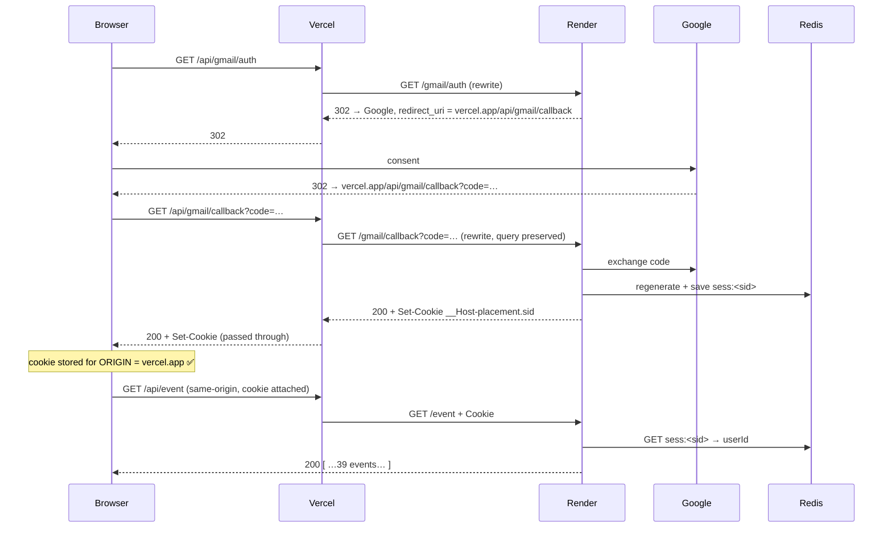

# Postmortem — Vercel/Render split-origin session authentication

**Date of investigation:** 2026-08-05
**Status:** Root cause identified and proven. Remediation partially deployed.
**Severity:** Total loss of authenticated functionality in production. No data loss.
**Author:** Reconstructed from repository state, git history, deployment
configuration, and live captures taken during the investigation.

---

# Executive summary

*If you read only one page, read this one.*

### Problem

A React SPA on Vercel and an Express API on Render were deployed to two
platform-assigned hostnames. Session authentication never worked in production.

### User-visible symptom

The dashboard displayed **"No events yet"** — silently, with no error — while the
database held 39 events and Google sign-in reported success.

### Root cause

Two defects, one masking the other.

1. **`VITE_API_URL` carried a trailing slash**, so the frontend requested
   `//event` and got a `404`. *(Resolved early; see [§5.2](#52-the-url-concatenation-bug-first-root-cause-resolved).)*
2. **The session cookie was minted on the wrong origin.** OAuth terminated on
   `…onrender.com`, so the browser filed `__Host-placement.sid` under the Render
   origin. Every API call came from a page on `…vercel.app` — a different
   registrable domain — so the browser withheld the cookie and Express refused
   the request with `401`. *(See [§5.3](#53-the-oauth--cookie-ownership-problem-primary-root-cause).)*

### Why it happened

> **The origin that terminates the OAuth callback owns the session cookie.**

`vercel.app` and `onrender.com` are both Public Suffix List entries, so the two
deployments are separate **sites**, not merely separate origins. A `SameSite=Lax`
cookie is withheld from cross-site subresource requests. Nothing in the
application code was wrong — the session layer, tenant scoping, Redis store, and
database were all correct throughout.

The failure was invisible because `Dashboard.tsx` has no `catch`: a `404` HTML
page, a `401` JSON body, and a genuinely empty result all render identically.

### Fixes applied

| # | Change | Kind |
|---|---|---|
| 1 | Removed the trailing slash from `VITE_API_URL` | infrastructure |
| 2 | `client/vercel.json` — rewrite `/api/*` → Render (`e751beb`) | code |
| 3 | `client/.env` — `VITE_API_URL=/api` (`1092d9b`) | code |
| 4 | Google Console — authorize `…vercel.app/api/gmail/callback` | infrastructure |
| 5 | Render — `GOOGLE_REDIRECT_URI` → the Vercel origin | infrastructure |
| 6 | Vercel — `VITE_API_URL=/api` + redeploy | **still outstanding** |

### Final architecture

Both the API *and* the OAuth callback are routed through the Vercel origin via a
rewrite, collapsing two sites into one. The cookie is minted and read on the same
origin, so `SameSite=Lax` is satisfied and CSRF protection is retained.
*(See [§5.4](#54-architecture-evolution--before-and-after) and [§6](#6-final-architecture).)*

### Outcome

Root cause proven with live captures and a server-side Redis witness. Steps 1–5
applied and verified; step 6 remains. **No data was lost** — all 39 event rows
were intact and correctly owned throughout.

### Lessons learned

1. Fixing *a* cause is not fixing *the* cause — the first bug masked the second.
2. **A proxy fixes the data plane, not the auth plane.** Both need fixing.
3. Build-time configuration is deployment state; **the built artifact is ground
   truth**, not the source.
4. When experiments cannot discriminate between hypotheses, choose a fix that is
   correct under all of them.
5. Silent empty states destroy diagnostic information at its cheapest point.

*Full detail in [§8](#8-lessons-learned).*

---

## Contents

| § | Section | Read it for |
|---|---|---|
| — | [Evidence conventions](#evidence-conventions) | How claims in this document are graded |
| [1](#1-initial-architecture) | Initial architecture | What was deployed, and the session design |
| [2](#2-original-deployment-flow) | Original deployment flow | How requests flowed before the fix |
| [3](#3-symptoms-observed) | Symptoms observed | What was actually seen, with evidence |
| [4](#4-investigation-timeline) | Investigation timeline | **Every hypothesis, including the rejected ones** |
| [5](#5-root-cause-analysis) | Root cause analysis | Why it broke — the technical core |
| [5.4](#54-architecture-evolution--before-and-after) | Architecture evolution | Before/after, visually |
| [6](#6-final-architecture) | Final architecture | Target state and OAuth sequence |
| [7](#7-every-change-made) | Every change made | Timeline, commits, configuration |
| [8](#8-lessons-learned) | Lessons learned | What to carry forward |
| [9](#9-verification-flow) | Verification flow | How to check this system end to end |
| [10](#10-production-debugging-checklist) | Debugging checklist | Reusable, system-agnostic |
| [11](#11-open-items-and-future-improvements) | Open items & future work | What still needs doing |

**Companion document:** [`docs/deployment.md`](../deployment.md) — the operational
guide for deploying this system. This postmortem explains *why*; the deployment
guide explains *how*.

---

## Evidence conventions

This document distinguishes three classes of claim. Please preserve the
distinction when editing.

| Marker | Meaning |
|---|---|
| **[PROVEN]** | Directly observed during this investigation, or read from repository/deployment state. Command output or file reference given. |
| **[INFERRED]** | Follows from proven facts plus documented behaviour of a specification or library. Reasoning stated so it can be checked. |
| **[UNPROVEN]** | Asserted elsewhere but not verifiable from this repository or investigation. Explicitly flagged rather than repeated as fact. |

This mirrors the `# Confidence` convention already used in
`docs/runbooks/troubleshooting.md`.

---

# 1. Initial architecture

Two independently deployed artifacts on two unrelated domains, plus three
managed backing services and Google as identity provider.

```
                            ┌─────────────────────────────────┐
                            │            BROWSER              │
                            │                                 │
                            │  cookie jar, partitioned by     │
                            │  ORIGIN — this is the crux      │
                            └───────┬─────────────────┬───────┘
                                    │                 │
                     static assets  │                 │  XHR / fetch
                     + app shell    │                 │  (cross-site)
                                    ▼                 ▼
            ┌───────────────────────────────┐   ┌──────────────────────────────┐
            │  VERCEL                       │   │  RENDER                      │
            │  placement-tracker-vert       │   │  placement-tracker-yar7      │
            │      .vercel.app              │   │      .onrender.com           │
            │                               │   │                              │
            │  React 19 + Vite 8 SPA        │   │  Express 5 (Node, ESM)       │
            │  static build, global CDN     │   │  free plan, Oregon, 1 inst.  │
            │                               │   │  service srv-d831s2l0lvsc…   │
            │  VITE_API_URL baked in        │   │                              │
            │  at BUILD time                │   │  express-session             │
            └───────────────────────────────┘   │  + connect-redis             │
                                                │  requireAuth middleware      │
                                                │  tenant-scoped repositories  │
                                                └───┬──────────┬───────────┬───┘
                                                    │          │           │
                                    ┌───────────────┘          │           └────────────┐
                                    ▼                          ▼                        ▼
                    ┌───────────────────────┐   ┌──────────────────────┐   ┌────────────────────┐
                    │  UPSTASH REDIS        │   │  NEON POSTGRES       │   │  GOOGLE OAUTH      │
                    │  rediss://…upstash.io │   │  ep-…ap-southeast-1  │   │  accounts.google   │
                    │                       │   │      .aws.neon.tech  │   │      .com          │
                    │  sess:*   sessions    │   │                      │   │                    │
                    │  user_sessions:* idx  │   │  Prisma 7 + adapter- │   │  openid, email,    │
                    │  bull:*   job queues  │   │  pg over POOLED url  │   │  profile,          │
                    │                       │   │  Migrate over DIRECT │   │  gmail.readonly    │
                    │  maxmemory 64MB       │   │                      │   │                    │
                    │  policy: noeviction   │   │  6 tenant-scoped     │   │  refresh_token     │
                    └───────────────────────┘   │  tables, userId NOT  │   │  stored server-    │
                                                │  NULL                │   │  side              │
                                                └──────────────────────┘   └────────────────────┘
```

**[PROVEN]** — service topology from `mcp__render__list_services`
(`srv-d831s2l0lvsc73csa5ig`, plan `free`, region `oregon`, `rootDir: backend`,
build `npm install && npx prisma generate && npm run build`, start `npm start`,
`autoDeploy: yes` on `main`); host names from `backend/.env`; Redis policy from
`INFO memory` → `maxmemory_policy:noeviction`, `maxmemory:67108864`.

### Session design

From `backend/src/modules/auth/session.config.ts`:

| Setting | Value | Source |
|---|---|---|
| Cookie name | `__Host-placement.sid` in production | `:27-28` — prefix applied only when `isProduction && !cookieDomain` |
| `httpOnly` | `true` | `:36` |
| `secure` | `isProduction` → `true` | `:39` |
| `sameSite` | `"lax"` — **hard-coded literal** | `:45` |
| `path` | `/` | `:47` |
| `domain` | omitted (`SESSION_COOKIE_DOMAIN` unset) | `:20`, `:49` |
| Idle TTL | 7 days, `rolling: true` | `:12`, `:108` |
| Absolute lifetime | 30 days | `:15` |
| Store | Redis, prefix `sess:` | `:90-95` |
| `saveUninitialized` | `false` | `:100` |

`sameSite` is the only cookie attribute in that file not derived from an
environment variable. **[PROVEN]** by reading the file.

> [!NOTE]
> Every value in this table is correct — for a **same-site** deployment. Nothing
> here is a misconfiguration. The session layer was well designed and behaved
> exactly as written; it was deployed into a topology it was never intended for.
> See [§5.3](#53-the-oauth--cookie-ownership-problem-primary-root-cause).

---

# 2. Original deployment flow

```mermaid
sequenceDiagram
    participant B as Browser
    participant V as Vercel (SPA)
    participant R as Render (Express)
    participant Rd as Redis
    participant N as Neon
    participant G as Google

    Note over B,V: App load
    B->>V: GET /
    V-->>B: index.html + bundle (VITE_API_URL baked in at build)

    Note over B,G: Authentication — entirely on the Render origin
    B->>R: GET /gmail/auth  (manual navigation; no UI entry point)
    R-->>B: 302 → accounts.google.com?redirect_uri=onrender.com/gmail/callback
    B->>G: consent
    G-->>B: 302 → onrender.com/gmail/callback?code=…
    B->>R: GET /gmail/callback?code=…
    R->>G: exchange code → id_token + refresh_token
    R->>N: upsert User, link GmailAccount
    R->>Rd: SET sess:<sid>  (establishSession → regenerate → save)
    R-->>B: 200 {"success":true} + Set-Cookie __Host-placement.sid
    Note over B: cookie stored for ORIGIN = onrender.com

    Note over B,N: Data fetch — cross-site
    B->>R: GET /event   (from vercel.app page)
    Note over B,R: ✗ Cookie header omitted by the browser
    R->>R: sessionMiddleware → anonymous session
    R-->>B: 401 {"success":false,"message":"Authentication required"}
```

The architectural flaw is visible in this diagram: the cookie is minted on the
**Render** origin, and read from a page served by the **Vercel** origin.

---

# 3. Symptoms observed

### 3.1 Dashboard shows "No events yet" **[PROVEN]**

`client/src/pages/Dashboard.tsx:65-69` renders the empty state whenever
`upcomingEvents.length === 0`. `fetchData` (`:22-30`) wraps the call in
`try`/`finally` with **no `catch`**, and coerces via
`Array.isArray(data) ? data : []`. Any non-array response — including a 401 JSON
body — therefore renders as emptiness rather than as an error.

### 3.2 `401 Unauthorized` **[PROVEN]**

```
GET https://placement-tracker-yar7.onrender.com/event
401 {"success":false,"message":"Authentication required"}
```

### 3.3 A `//event` 404 preceded the 401 **[PROVEN]**

The first deployed bundle observed (`/assets/index-BBFcAkX1.js`) contained:

```js
d = `https://placement-tracker-yar7.onrender.com/`,   // trailing slash
f = async () => (await fetch(`${d}/event`))            // → //event
```

Reproduced exactly:

```bash
curl -i --path-as-is 'https://placement-tracker-yar7.onrender.com//event'
# HTTP/1.1 404 Not Found ... <pre>Cannot GET //event</pre>
```

`res.json()` on that HTML body throws a `SyntaxError`, which the missing `catch`
swallows — producing the same "No events yet" as a successful empty response.

### 3.4 OAuth appearing to succeed **[PROVEN]**

It did succeed. The callback returned `{"success":true,"email":"…"}` and wrote a
session. This was never a failure — it only *looked* like one because the
resulting cookie was unusable by the application.

### 3.5 Sessions apparently existing **[PROVEN]**

Four live sessions were present in Redis at various points, including
`sess:4mSEzOjm…` (`createdAt 06:57:49Z`, `secure:true`) and `sess:7KFBihwn…`
(`createdAt 09:42:00Z`, `secure:true`). Both were minted by the production
backend. Two older ones carried `"secure":false`, which is only produced when
`NODE_ENV !== "production"` (`session.config.ts:39`) — i.e. they originated from
local development runs against the shared Upstash instance.

### 3.6 Browser behaving differently than expected **[PROVEN]**

The same browser profile, same cookie jar, same live session, seconds apart:

| Request | Result |
|---|---|
| Top-level navigation to `onrender.com/event` | **200**, 39 events |
| `fetch(…)` from `vercel.app` with `credentials:"include"` | **401** |
| Same-origin `fetch("/event")` on `onrender.com` | **200**, 39 events |

### 3.7 Render free-tier cold start **[PROVEN]**

```
08:15:31  ==> Running 'npm start'      instance srv-…-x54ct   (new instance id)
08:16:01  Server running on port 10000
```

≈30 seconds from request to ready. This aborted one OAuth attempt mid-flow.

### 3.8 Prisma migration failures / P1001 / IPv6

**[UNPROVEN — not observed in this investigation.]** See
[§5.1](#51-prisma--database-networking). `P1001` *is* documented in
`docs/runbooks/troubleshooting.md:264`, attributed there to Neon auto-suspend.
**IPv6 and WSL have zero occurrences anywhere in `docs/` or the codebase** and
cannot be documented as fact.

> [!WARNING]
> **Common mistake when extending this document.** Do not fold
> database-connectivity folklore into this incident. No Prisma migration failure
> occurred during this investigation, and the database layer was verified
> healthy at every step. Mixing the two produces a postmortem that blames the
> wrong subsystem.

---

# 4. Investigation timeline

Chronological. Rejected hypotheses are retained deliberately — several were
mine, and two were wrong in instructive ways.

> [!IMPORTANT]
> **Do not prune this section.** The rejected hypotheses are the institutional
> knowledge. H2 (ownership), H3 (CORS), H4 (middleware order), and H5 (Redis)
> are the four things a future engineer will suspect first, and each is
> pre-eliminated here with evidence. H7 and H9 are recorded mistakes of mine,
> kept with their disproof.

**Quick index.** ✅ accepted · ❌ rejected · ⚠️ unresolved

| | Hypothesis | Verdict |
|---|---|---|
| [H1](#h1--the-frontend-calls-a-malformed-url) | Frontend calls a malformed URL | ✅ accepted — first root cause |
| [H2](#h2--the-backend-returns-an-empty-array-because-of-ownership-filtering) | Ownership filtering returns `[]` | ❌ rejected |
| [H3](#h3--cors-is-misconfigured) | CORS misconfigured | ❌ rejected |
| [H4](#h4--middleware-ordering-or-a-missing-passportsession-restore) | Middleware ordering | ❌ rejected |
| [H5](#h5--redis-is-unreachable-or-sessions-are-never-created) | Redis unreachable / no sessions | ❌ rejected |
| [H6](#h6--the-frontend-never-sends-credentials) | Frontend never sends credentials | ✅ real defect — ❌ not the full cause |
| [H7](#h7--credentials-include-alone-is-sufficient) | `credentials:"include"` suffices | ❌ rejected *(my error)* |
| [H8](#h8--samesitelax-is-the-operative-browser-rule) | `SameSite=Lax` is the operative rule | ⚠️ **never proven** — three rules indistinguishable |
| [H9](#h9--upstash-evicted-a-session-key) | Upstash evicted a session | ❌ rejected *(my error)* |
| [H10](#h10--deploying-the-vercel-rewrite-falsifies-the-cross-site-hypothesis) | Rewrite falsifies cross-site theory | ❌ rejected — hypothesis was untested |
| [H11](#h11--the-vercel-rewrite-alone-restores-authentication) | Rewrite alone restores auth | ❌ rejected — **key finding** |

---

### H1 — The frontend calls a malformed URL

**Hypothesis.** The API base and the path concatenate to something the backend
does not route.

**Experiment.** Downloaded the live bundle, extracted the baked constant and the
`fetch` call sites, then replayed the exact URL with `curl --path-as-is`.

**Evidence.** `d = "https://…onrender.com/"` (trailing slash) + `` `${d}/event` ``
= `//event` → `404 Cannot GET //event`. **[PROVEN]**

**Conclusion. ACCEPTED.** This was the first failure and it masked everything
behind it. Fixed out-of-band by removing the trailing slash from the Vercel
environment variable, after which the symptom became a 401.

---

### H2 — The backend returns an empty array because of ownership filtering

**Hypothesis.** The recent ownership-enforcement migration (commits `9425580`
through `20f491e`) scopes every query by `userId`. Legacy rows with `NULL`
ownership, or rows owned by a different user, would return `[]`.

**Experiment.** Read-only SQL against Neon.

**Evidence.**

```
Event count total : 39 events, 39 with_owner
Events per owner  : userId=1 → 39
Users             : id=1, ankitanand3058@gmail.com, status=active, deleted=false
```

`backend/prisma/migrations/20260802030000_require_ownership/migration.sql` sets
`Event.userId` `NOT NULL`, so unowned rows cannot exist. **[PROVEN]**

**Conclusion. REJECTED.** The data layer was never at fault. All 39 rows were
present, owned, and reachable — later confirmed end-to-end when authenticated
requests returned exactly 39 events.

---

### H3 — CORS is misconfigured

**Hypothesis.** A credentialed cross-origin request needs
`Access-Control-Allow-Credentials: true` and an exact-origin
`Access-Control-Allow-Origin`. A wildcard or mismatch would break it.

**Experiment.** Inspected live response headers.

**Evidence.**

```
access-control-allow-origin: https://placement-tracker-vert.vercel.app
access-control-allow-credentials: true
vary: Origin
```

Exactly correct, matching `app.ts:21-26`. **[PROVEN]**

**Conclusion. REJECTED.** Worth stating explicitly because this is the most
common misdiagnosis of this symptom: CORS governs whether the browser will
**expose the response** to JavaScript. It has no influence on whether the browser
**attaches the cookie**. That decision is made earlier.

---

### H4 — Middleware ordering, or a missing passport/session restore

**Hypothesis.** `requireAuth` runs before `req.session` is populated.

**Experiment.** Read `backend/src/app.ts` and `event.routes.ts`.

**Evidence.** `sessionMiddleware` is mounted at `app.ts:34`; routes at `:63-66`;
`requireAuth` inside `event.routes.ts:19`. Ordering is correct. No passport in
the project. **[PROVEN]**

**Conclusion. REJECTED.**

---

### H5 — Redis is unreachable, or sessions are never created

**Hypothesis.** The session store fails silently, so nothing is ever persisted.

**Experiment.** Render boot logs; direct Redis inspection.

**Evidence.** `✅ Redis (session) connected` at boot. Live `sess:*` keys present
with correct shape. `establishSession` writes inside the `save()` callback
(`session.service.ts:86-94`), so a key's existence proves `save()` completed.
**[PROVEN]**

**Conclusion. REJECTED.**

---

### H6 — The frontend never sends credentials

**Hypothesis.** `fetch()` defaults to `credentials: "same-origin"`. On a
cross-origin request that omits the cookie entirely.

**Experiment.** Exhaustive search of the deployed bundle
(`index-CoCi855r.js`, sha256 `36e38b33…`) for `credentials`.

**Evidence.** Three occurrences of the string `include`, **all React DOM
internals** (`crossOrigin === "use-credentials"`, `Array.prototype.includes`).
Zero `credentials:` properties. `git grep` across every local and remote ref
found no occurrence in `client/src` on any branch. **[PROVEN]**

**Conclusion. ACCEPTED as a real defect — REJECTED as the complete explanation.**
See [H7](#h7--credentials-include-alone-is-sufficient). This distinction cost real
time and is the most important lesson in [§8](#8-lessons-learned).

---

### H7 — `credentials: "include"` alone is sufficient

**Hypothesis.** Adding the missing option restores authentication.

**Experiment.** From the live Vercel page, in a browser holding a valid session
cookie, issued the identical request with `credentials: "include"` explicitly set.

**Evidence.**

```
fetch(U)                          → 401
fetch(U,{credentials:"include"})  → 401     ← still refused
```

Redis witness confirmed server-side: `lastSeenAt` unchanged, TTL continued
decaying without reset. **[PROVEN]**

**Conclusion. REJECTED.** A second barrier exists behind the first.

---

### H8 — `SameSite=Lax` is the operative browser rule

**Hypothesis.** `vercel.app` and `onrender.com` are both Public Suffix List
entries, so the registrable domains differ and the request is cross-**site**.
`SameSite=Lax` permits cross-site cookies only on top-level navigations with a
safe method; `fetch` is a subresource request and cannot qualify.

**Experiment.** Attempted to obtain Chrome's recorded exclusion reason via four
routes: `read_network_requests`, console messages, `chrome://settings/cookies`,
and the Storage Access APIs.

**Evidence.** All four failed to yield a reason.

- Network tooling returns URL/method/status only — no `blockedReasons`.
- Console was empty across two page loads; Chrome moved cookie exclusions to the
  Issues panel.
- `chrome://` navigation is blocked to the automation extension.
- Storage Access APIs returned `granted` / `true` / `prompt`, all evaluated in a
  first-party top-level context where they are trivially true.

Chrome records the reason only in CDP `Network.requestWillBeSentExtraInfo`
→ `associatedCookies[].blockedReasons[]` and `Audits.issueAdded`
→ `cookieExclusionReason`. Neither surface was reachable. **[PROVEN that the
reason could not be obtained.]**

**Conclusion. NOT PROVEN — and deliberately not asserted.** Three candidate
rules — `SameSite=Lax`, third-party cookie phaseout, and cookie partitioning —
**predict identical observables** in every experiment available. The top-level
navigation succeeding does not discriminate between them, because a top-level
navigation makes `onrender.com` the *first* party under all three.

Discriminating would require either Chrome's `blockedReasons`, or a backend
endpoint echoing `req.headers.cookie` (a code change that was out of scope).
Browser: Chrome 150. **[PROVEN]**

**This uncertainty is why the chosen remediation removes the cross-site
condition rather than negotiating with it.** A same-origin request satisfies all
three rules simultaneously, so the fix is correct without needing to know which
one fires.

---

### H9 — Upstash evicted a session key

**Hypothesis.** Session `AkLZhqAZ…` vanished from Redis while still listed in
`user_sessions:1`. The `session-redis.ts` comments warn about eviction policy,
so eviction seemed plausible.

**Experiment.** `INFO memory`, `INFO stats`.

**Evidence.**

```
maxmemory_policy: noeviction
evicted_keys: 0
expired_keys: 0
```

**[PROVEN]**

**Conclusion. REJECTED — this was my error.** `establishSession` calls
`req.session.regenerate()` (`session.service.ts:71`), which destroys the prior
session before writing the new one. A second login from the same browser
destroyed `AkLZhqAZ…` and created its replacement. `regenerate` does not
de-index, so the stale index member is expected — behaviour the code documents
as tolerated (`session.service.ts:14-18`). No infrastructure problem existed.

---

### H10 — Deploying the Vercel rewrite falsifies the cross-site hypothesis

**Hypothesis.** After commit `e751beb` was deployed and the rewrite verified
working, `/event` still returned 401 — suggesting cross-site was not the cause.

**Experiment.** Checked what was actually deployed.

**Evidence.**

```
deployed bundle  index-CoCi855r.js →  d = `https://placement-tracker-yar7.onrender.com`
live redirect_uri                  →  https://placement-tracker-yar7.onrender.com/gmail/callback
```

**[PROVEN]** The application had never issued a single request through `/api`,
and OAuth still terminated on Render. Commit `e751beb` is additive by design; it
changes no request path until `VITE_API_URL` is repointed.

**Conclusion. REJECTED.** The hypothesis had not been tested. Three of four
required changes had not been made.

---

### H11 — The Vercel rewrite alone restores authentication

**Hypothesis.** Routing `/api/*` through the frontend origin makes the request
same-origin, so the cookie is attached.

**Experiment (capture C).** From the live Vercel page, in a browser holding a
valid `onrender.com` session cookie, called `fetch("/api/event")` through the
deployed rewrite.

**Evidence.** **401.** Redis witness: `lastSeenAt` unchanged, TTL kept decaying.
**[PROVEN]**

**Conclusion. REJECTED — and this is the single most valuable finding of the
investigation.** The request was correctly formed and genuinely same-origin, but
carried no cookie, because **no cookie exists for the `vercel.app` origin**. The
rewrite fixes where the app *fetches data*; it does nothing about where the
session is *minted*. See [§5.3](#53-the-oauth--cookie-ownership-problem-primary-root-cause).

---

### The capture matrix

All four captures ran in one browser profile, one cookie jar, against session
`sess:7KFBihwn…`, interleaved. **[PROVEN]**

| # | Request | Origin | Status | `lastSeenAt` | TTL |
|---|---|---|---|---|---|
| — | baseline | — | — | `09:42:00.083` | 323s used |
| A | `fetch("/event")` | `onrender.com` same-origin | **200** · 39 | `09:56:58.423` ✅ | **reset** |
| B | app's own request | `vercel.app` → `onrender.com` | **401** | unchanged ✗ | decaying |
| C | `fetch("/api/event")` via rewrite | `vercel.app` same-origin | **401** | unchanged ✗ | decaying |
| D | re-run A (control) | `onrender.com` same-origin | **200** · 39 | `10:01:05.678` ✅ | **reset** |

**The witness mechanism.** `requireAuth` is the only code that writes
`req.session.lastSeenAt` (`auth.middleware.ts:100`), and `rolling: true`
(`session.config.ts:108`) resets the store TTL only on a session actually
loaded. So an advancing `lastSeenAt` plus a reset TTL is server-side proof that
the cookie arrived, express-session restored it, Redis was queried, and
`requireAuth` passed. Their absence proves none of that happened.

This substituted for instrumenting the backend, which was out of scope.
Capture D proves the session was alive throughout, so B and C are not expiry.

> [!TIP]
> **Reusable technique.** When the thing you need to observe is invisible from
> the client, look for existing server-side state that already records it. Here,
> `rolling: true` plus a single `lastSeenAt` write turned Redis into a witness
> for "did the browser send the cookie?" — a question the Fetch spec otherwise
> makes unanswerable. See [§9](#9-verification-flow) checkpoint ⑤.

---

# 5. Root cause analysis

## 5.1 Prisma / database networking

**Scope note.** No Prisma migration failure, `P1001` error, or IPv6 condition
was observed during this investigation. What follows is what the repository
proves.

### Proven from the repository

**The pooled/direct URL split.** `backend/.env.example` documents two variables
with opposite requirements:

- `DATABASE_URL` — **pooled**. Read by `src/lib/prisma.ts` and passed to the
  `PrismaPg` adapter. Many short-lived queries across concurrent handlers.
- `DIRECT_DATABASE_URL` — **direct, no pooler**. Read by `prisma.config.ts:37`
  (`url: env("DIRECT_DATABASE_URL")`), used by `prisma migrate`/`db`/`studio`.

The stated reason: migrations take a **session-level advisory lock** to serialise
concurrent deploys, and a transaction pooler such as PgBouncer cannot hold one —
the lock is taken on one backend connection and released to another. Running DDL
through a transaction pooler is unsafe for the same reason. **[PROVEN]** by
reading `.env.example` and `prisma.config.ts`.

On Neon the two differ only by the `-pooler` suffix on the host. Both values are
present in `backend/.env`, pointing at the same `ep-…​.ap-southeast-1.aws.neon.tech`
project. **[PROVEN]**

**Prisma 7 removed `url`/`directUrl` from `schema.prisma`**, so the split is
expressed by *which side reads which variable*, not by schema configuration.
**[PROVEN]** — `prisma.config.ts:6`.

**A committed-credential remediation happened on 2026-08-01.**
`docs/03_Development/MIGRATION_2026-08-01_database-url-from-env.md` records that
`prisma.config.ts` previously contained a hardcoded connection string, that four
compiled artifacts carrying the same credential were tracked in git, and that the
credential is exposed in history at commits `94ee15d` and `eb978e7` — **both
confirmed to exist in this repository**. A second bug disappeared with it: the
Prisma CLI read the hardcoded literal while the runtime read `DATABASE_URL`, so
migrations could be applied to one database while the API talked to another.
**[PROVEN]** by reading that document and verifying the commits resolve.

**`P1001` is documented, with a different cause than suggested.**
`docs/runbooks/troubleshooting.md:264-268` attributes `P1001: Can't reach
database server` on a `*.neon.tech` host to **Neon auto-suspend** — Neon pauses
idle instances and the first connection fails while it wakes.
`docs/runbooks/local-development.md:106` records the same signature — "is slow;
the second succeeds" — and `:383` names it explicitly as "the Neon
`P1001`-then-success cold-start behaviour". Also documented at
`docs/runbooks/migrations.md:289`. Both runbooks' confidence sections rate it as
verified by execution. **[PROVEN]** that the repository documents this;
**[UNPROVEN]** by me independently.

**Shadow-database failures are the documented `migrate dev` hazard**, not a
"schema engine" fault. `docs/runbooks/migrations.md:97-101` explains that Prisma
replays the entire migration chain against an empty shadow database, which is why
`20260802020000_backfill_ownership/migration.sql:12` and
`20260701000000_add_email_gmail_and_extraction_link/migration.sql:6` both carry
explicit comments about surviving that replay. `migrate deploy` applies pending
migrations without a shadow database (`migrations.md:84`). **[PROVEN]**

### Cannot be proven

| Claim | Status |
|---|---|
| An IPv6-related connectivity investigation occurred | **[UNPROVEN]** — zero occurrences of `IPv6`/`ipv6` anywhere in `docs/` or the codebase |
| WSL-vs-Windows behavioural difference | **[UNPROVEN]** — zero occurrences of `WSL`/`wsl` |
| Prisma "schema engine" failure | **[UNPROVEN]** — `troubleshooting.md` documents a *shadow database* failure and `schema.prisma` being clobbered by `db pull`, which are different things |

`backend/bash.exe.stackdump` exists in the working tree — a Git-Bash crash
artifact on Windows. It is **not** evidence of any specific Prisma or networking
failure and should not be cited as such. It should probably be deleted and
gitignored.

**If an IPv6 or WSL investigation did occur, it happened outside this
repository's recorded history and outside this investigation.** Whoever has that
context should add it here; I will not reconstruct it from assumption.

---

## 5.2 The URL concatenation bug (first root cause, resolved)

`VITE_API_URL` carried a trailing slash; `eventApi.ts:4` adds another. Vite
inlines the value at **build** time, so the defect was frozen into the bundle.
`new URL()` does not collapse `//` in a path, Express does not match `//event`
against a `/event` mount, and the missing `catch` in `Dashboard.tsx` rendered the
resulting HTML 404 as "No events yet".

Three independent failures compounded into one silent symptom: a bad env value, a
missing `catch`, and an empty-state that is indistinguishable from an error
state.

---

## 5.3 The OAuth / cookie-ownership problem (primary root cause)

### The registrable-domain fact

`SameSite` is evaluated against **site** (eTLD+1), not origin.

| | Host | Public suffix | Registrable domain |
|---|---|---|---|
| Frontend | `placement-tracker-vert.vercel.app` | `vercel.app` | `placement-tracker-vert.vercel.app` |
| Backend | `placement-tracker-yar7.onrender.com` | `onrender.com` | `placement-tracker-yar7.onrender.com` |

Both suffixes are Public Suffix List entries, so each host is its own registrable
domain. This is **not** the benign "two subdomains of one company domain" case.
There is no `Domain` attribute value that could bridge them — a cookie cannot be
set for a public suffix. **[INFERRED]** from the PSL plus RFC 6265bis; the
resulting behaviour is **[PROVEN]** by the capture matrix.

### Why cookie ownership follows the OAuth callback

`Set-Cookie` is attributed to the origin **the browser believes it is talking
to** — not to whichever server generated the header. The OAuth callback is the
only place a session cookie is minted, so:

> **Whichever origin terminates the OAuth callback owns the session cookie.**

The redirect target is a server-side value. `backend/src/modules/gmail/
gmail.service.ts:6-10` constructs the OAuth client from
`process.env.GOOGLE_REDIRECT_URI`, and `generateAuthUrl()` derives `redirect_uri`
from that same client. **[PROVEN]**

> [!IMPORTANT]
> **This is the single transferable lesson of the incident.** If you remember
> nothing else from this document, remember that one sentence. Everything in
> [§5.4](#54-architecture-evolution--before-and-after), [§6](#6-final-architecture),
> and the entire deployment order follows from it.

### Why the Vercel rewrite alone did not solve authentication

This is the crux, and capture C proves it rather than merely arguing it.

The system has **two independent planes**:

```
DATA PLANE    app  →  /api/event  →  [Vercel rewrite]  →  Render
              └── fixed by VITE_API_URL=/api (commit 1092d9b)

AUTH PLANE    browser → /gmail/auth → Google → /gmail/callback → Set-Cookie
              └── governed by GOOGLE_REDIRECT_URI
                  ── NOT touched by either commit
```

Routing the *authorization request* through the proxy changes nothing, because
`redirect_uri` is embedded server-side in the URL Google redirects back to.
**[PROVEN]** — `/gmail/auth` and `/api/gmail/auth` returned **byte-identical**
`redirect_uri` values.

So with the rewrite deployed but `GOOGLE_REDIRECT_URI` still pointing at Render:

1. Login terminates on `onrender.com` → cookie stored for `onrender.com`.
2. App calls `vercel.app/api/event` → same-origin, correctly formed.
3. Browser attaches cookies belonging to `vercel.app` → **there are none**.
4. Express receives no cookie → anonymous session → 401.

Capture C is exactly this scenario: **401**, with the Redis witness confirming no
session reached Express.

Worse, commit `1092d9b` alone would be a **regression** in one respect: today the
`onrender.com` cookie is at least usable against the Render origin directly. Once
the app talks only to the Vercel origin, no path remains by which it can
authenticate at all.

### Why `GOOGLE_REDIRECT_URI` also had to move

To make the callback terminate on the Vercel origin, so `Set-Cookie` lands
first-party there. This requires **two** changes, and their order is a hard
constraint:

1. **Google Cloud Console** must authorize
   `https://placement-tracker-vert.vercel.app/api/gmail/callback`.
2. **Render** `GOOGLE_REDIRECT_URI` must be set to the same string.

Google validates `redirect_uri` against the registered list before anything else.
Flipping Render's variable first makes *every* login fail with
`redirect_uri_mismatch`, including the previously working one, with no way back
in until Console is updated.

**[PROVEN]** by direct probe of Google's authorize endpoint. Before the change:

```
onrender.com/gmail/callback         → REGISTERED (proceeded to sign-in)
vercel.app/api/gmail/callback       → NOT REGISTERED (redirect_uri_mismatch)
```

After the operator applied both changes, re-probed:

```
redirect_uri (live, from running process) → https://placement-tracker-vert.vercel.app/api/gmail/callback
Google Console registration               → REGISTERED
```

### Contributing factor: no login entry point

The deployed bundle contains **zero** occurrences of `gmail`, `auth`, `login`,
`signin`, or `sign-in`. `App.tsx` renders only `Dashboard`. **[PROVEN]** by
searching the bundle. Login is reachable only by manually typing a URL — which
means it is also easy to enter at the *wrong* URL and mint a cookie on the wrong
origin, producing a 401 indistinguishable from the original bug.

---

## 5.4 Architecture evolution — before and after

The whole incident reduces to **one question: which origin owns the cookie?**
These two diagrams differ in exactly one place — where the OAuth callback lands.

### BEFORE — two sites, cookie stranded on Render

```
  ┌─────────┐                                    ┌─────────┐
  │ BROWSER │                                    │ BROWSER │
  └────┬────┘                                    └────┬────┘
       │  ① OAuth                                     │  ② Data fetch
       │                                              │
       ▼                                              ▼
  ┌──────────────┐                              ┌──────────────┐
  │ Google       │                              │ VERCEL       │
  └──────┬───────┘                              │ vercel.app   │
         │ redirect_uri =                       └──────┬───────┘
         │ onrender.com/gmail/callback                 │ fetch()
         ▼                                             │ cross-SITE
  ┌──────────────────────┐                             ▼
  │ RENDER               │                      ┌──────────────────────┐
  │ onrender.com         │                      │ RENDER               │
  │                      │                      │ onrender.com         │
  │ Set-Cookie ──────────┼──► 🍪 stored for     │                      │
  │                      │    onrender.com      │ ✗ NO Cookie header   │
  └──────────────────────┘                      │   (browser withheld) │
                                                │                      │
       Cookie lives HERE  ─────╳─────────────►  │ → 401 Unauthorized   │
                          never reaches         └──────────────────────┘
                          the data request
```

**Two different sites.** `vercel.app` and `onrender.com` are separate registrable
domains, so the cookie minted in ① is invisible to the request in ②.

### AFTER — one site, cookie and data on the same origin

```
  ┌─────────┐                                    ┌─────────┐
  │ BROWSER │                                    │ BROWSER │
  └────┬────┘                                    └────┬────┘
       │  ① OAuth                                     │  ② Data fetch
       ▼                                              ▼
  ┌──────────────┐                              ┌──────────────────────┐
  │ Google       │                              │ VERCEL  vercel.app   │
  └──────┬───────┘                              │                      │
         │ redirect_uri =                       │ GET /api/event       │
         │ vercel.app/api/gmail/callback        │ 🍪 Cookie ATTACHED   │
         ▼                                      │    (same-origin)     │
  ┌──────────────────────┐                      │        │             │
  │ VERCEL  vercel.app   │                      │        ▼ rewrite     │
  │   │ rewrite          │                      └────────┼─────────────┘
  │   ▼                  │                               ▼
  │ RENDER (upstream)    │                      ┌──────────────────────┐
  │ Set-Cookie ──────────┼──► 🍪 stored for     │ RENDER (upstream)    │
  │ (passed through)     │    vercel.app        │ Cookie forwarded     │
  └──────────────────────┘                      │ → 200 · 39 events    │
                                                └──────────────────────┘
       Cookie lives HERE  ───────────────────►  same origin ✅
```

**One site.** The rewrite makes Render an *upstream*, not an origin. The browser
only ever sees `vercel.app`.

### The one-line difference

| | BEFORE | AFTER |
|---|---|---|
| `GOOGLE_REDIRECT_URI` | `…onrender.com/gmail/callback` | `…vercel.app/api/gmail/callback` |
| Cookie stored for | `onrender.com` | `vercel.app` |
| App calls | `onrender.com/event` | `vercel.app/api/event` |
| Relationship | **cross-site** | **same-origin** |
| Result | `401` | `200` · 39 events |

> [!IMPORTANT]
> **Why the rewrite alone was not enough.** Adding the rewrite fixed only the
> right-hand column (the data plane). Until `GOOGLE_REDIRECT_URI` also moved, the
> left-hand column still terminated on Render — so the cookie was still stored
> for the wrong origin, and a *correctly formed same-origin request* still
> returned `401`. This was proven, not assumed: see capture C in
> [§4 H11](#h11--the-vercel-rewrite-alone-restores-authentication).

---

# 6. Final architecture

For the *contrast* between this and the original — the one-line difference that
mattered — see [§5.4](#54-architecture-evolution--before-and-after). This section
gives the detailed target state.

## 6.1 Target request flow

```
   ┌─────────┐
   │ BROWSER │  cookie jar holds __Host-placement.sid for
   └────┬────┘  placement-tracker-vert.vercel.app  ← ONE origin only
        │
        │  fetch("/api/event")   ← relative, SAME-ORIGIN
        │  cookie attached under default "same-origin" credentials mode
        │  no CORS, no SameSite question, no third-party cookie policy
        ▼
   ┌──────────────────────────────────────────────┐
   │ VERCEL   placement-tracker-vert.vercel.app   │
   │                                              │
   │  /assets/*  → static (filesystem wins)       │
   │  /api/:path*→ REWRITE  ─────────────────┐    │
   └─────────────────────────────────────────┼────┘
                                             │  Cookie header forwarded
                                             ▼
   ┌──────────────────────────────────────────────┐
   │ RENDER   placement-tracker-yar7.onrender.com │
   │                                              │
   │  express.json → sessionMiddleware → routes   │
   │  requireAuth → requireTenantContext          │
   └──────┬────────────────────────────┬──────────┘
          │                            │
          ▼                            ▼
   ┌──────────────┐            ┌──────────────────┐
   │ UPSTASH      │            │ NEON POSTGRES    │
   │ GET sess:… │            │ WHERE userId = …  │
   └──────────────┘            └──────────────────┘
```

## 6.2 OAuth flow, after remediation



**The essential difference:** the cookie is minted on the **same origin** the
application calls. `SameSite=Lax` is satisfied, CSRF protection is retained, and
the `__Host-` prefix remains valid (`Secure` ✓, no `Domain` ✓, `Path=/` ✓).

---

# 7. Every change made

## 7.1 Deployment timeline

Chronological narrative of what was deployed, in what order, and what confirmed
each step. **Infra** = configuration outside the repository; **code** = a commit.

| # | Step | Why it was necessary | Evidence that confirmed it | Kind |
|---|---|---|---|---|
| 1 | **Initial deployment** — SPA on Vercel, API on Render, Neon + Upstash wired, ownership migration live (`20f491e`) | Baseline. Deploy `dep-d9pcpjjm8hqs73fau4m0` reported `live` | `/health` → `{"status":"ok","database":"connected"}` | infra |
| 2 | **Symptom reported** — dashboard shows "No events yet" | Neon held 39 rows; the UI showed none | Read-only SQL: 39 events, all `userId=1` | — |
| 3 | **Found the `//event` bug** | Bundle baked `VITE_API_URL` with a trailing slash; `` `${d}/event` `` produced `//event` | `curl --path-as-is …//event` → `404 Cannot GET //event`, reproduced exactly | — |
| 4 | **Fixed the trailing slash** (Vercel env + redeploy) | Restore route matching | New bundle `index-CoCi855r.js` → `d = "…onrender.com"`, no slash. Symptom changed `404` → `401` | infra |
| 5 | **Diagnosed the 401** | Ruled out ownership, CORS, middleware order, Redis (see [§4](#4-investigation-timeline)) | Capture matrix: same-origin `200`, cross-site `401`, with Redis witness | — |
| 6 | **Added the Vercel rewrite** (`e751beb`) | Collapse two sites into one origin | `/api/health` → `200`, `/api/event` → `401` (reached Express) | **code** |
| 7 | **Proved the rewrite was insufficient** | Capture C: same-origin `/api/event` still `401` | Redis witness frozen — no session reached Express | — |
| 8 | **Registered the new redirect URI** in Google Console | Google validates `redirect_uri` before anything else | Probe changed `redirect_uri_mismatch` → proceeds to sign-in | infra |
| 9 | **Changed `GOOGLE_REDIRECT_URI`** on Render, restarted | Move cookie ownership to the Vercel origin | Live `Location` header now emits the `vercel.app` URI | infra |
| 10 | **Changed `VITE_API_URL=/api`** (`1092d9b`) | Route the data plane through the rewrite | `npm run build` passes; bundle resolves `d = "/api"`, zero `onrender` occurrences | **code** |
| 11 | **Vercel env + redeploy** | Vite inlines at build time — the deployed bundle must be rebuilt | — | **⚠ NOT YET APPLIED** |
| 12 | **Login and session restore** | End-to-end verification | — | **⚠ pending step 11** |

> [!WARNING]
> **Steps 11–12 have not been performed.** Until the Vercel environment variable
> is changed *and* the project redeployed, the live bundle continues to call the
> absolute Render URL and the `401` persists. Commits `e751beb` and `1092d9b`
> exist on `feat/vercel-api-proxy` but are **not pushed and not merged**.

> [!NOTE]
> **Step 8 must precede step 9.** Google validates `redirect_uri` against the
> registered list before anything else, so flipping Render's variable first
> breaks *every* login — including the one that previously worked — with no way
> back in until Console is updated. Full reasoning in
> [Deployment Guide §7](../deployment.md#7-deployment-order).

## 7.2 Commit history

Commits that matter for understanding this incident.

| Commit | Date | Purpose | Files changed | Why it exists |
|---|---|---|---|---|
| **`e751beb`** | 2026-08-05 | Route `/api/*` through the frontend origin | `client/vercel.json` (+9) | Removes the cross-site condition rather than negotiating with it — correct under all three candidate browser rules ([§4 H8](#h8--samesitelax-is-the-operative-browser-rule)) |
| **`1092d9b`** | 2026-08-05 | Point the API base at the rewrite | `client/.env` (1 line) | Makes requests same-origin so the cookie attaches under fetch's default `same-origin` credentials mode |
| `20f491e` | 2026-08-05 | Complete ownership transition, restore Gmail pipeline | backend migration scripts | **The deployed backend commit.** Head of `main` throughout the investigation |
| `9425580` | 2026-08-02 | Ownership enforcement migration | `prisma/migrations/20260802030000_require_ownership` | Made `Event.userId` `NOT NULL` — why H2 (unowned rows) could be rejected outright |
| `513281f` | 2026-08-02 | Repository-wide tenant guards | repositories | Every query bounded by owner; the scoping H2 suspected |
| `266c211` | 2026-08-02 | Request authentication middleware | `auth.middleware.ts` | Introduced `requireAuth` — the code that returns the `401` |
| `0adff5e` | 2026-08-02 | Redis-backed session management | `session.config.ts`, `session.service.ts` | Introduced `__Host-placement.sid`, `SameSite=Lax`, and `rolling: true` — the cookie whose origin binding caused the incident, and the TTL behaviour that became the investigation's witness |
| `32966e8` | 2026-08-02 | Resolve Google identity before authentication | `gmail.controller.ts` | The OAuth callback that mints the cookie — i.e. the code whose *URL* decides cookie ownership |
| `c73d554` | 2026-05-15 | `fix: correct production cors origin` | `app.ts` | An earlier attempt at this same class of problem, from Render's deploy history. CORS was **not** the cause then either ([§4 H3](#h3--cors-is-misconfigured)) |
| `94ee15d`, `eb978e7` | 2026-03-24 / 2026-05-15 | — | — | Contain the **exposed database credential** noted in the 2026-08-01 migration note. Rotation status not verifiable from the repository ([§5.1](#51-prisma--database-networking)) |

> [!NOTE]
> No backend commit was required to fix this incident. Both remediation commits
> touch only `client/`. The backend was correct throughout — the defect was in
> deployment topology, not application logic.

## 7.3 Repository commits — detail

### `e751beb` — `feat(deploy): proxy the API through the frontend origin`

**What.** New file `client/vercel.json`:

```json
{
  "$schema": "https://openapi.vercel.sh/vercel.json",
  "rewrites": [
    { "source": "/api/:path*", "destination": "https://placement-tracker-yar7.onrender.com/:path*" }
  ]
}
```

**Why.** Removes the cross-site condition instead of negotiating with it —
correct regardless of which of the three candidate browser rules fires (§4 H8).

**Solves.** Makes the API reachable at the frontend's own origin. Prefix-generic
so it also covers `/api/gmail/auth` and `/api/gmail/callback`, which is required
for the auth plane, not just the data plane.

**Notes.** The destination is hard-coded because Vercel does not interpolate
environment variables into rewrite destinations. Additive on its own — it changed
no behaviour until `VITE_API_URL` was repointed.

### `1092d9b` — `feat(client): call the API through the same-origin /api path`

**What.** `client/.env`: `VITE_API_URL=http://localhost:5000/api` → `/api`.

**Why.** Points the API base at the rewrite. The previous value was wrong in both
environments it claimed to serve: the backend listens on **3000**, not 5000, and
mounts routes at `/event` and `/email` with **no `/api` prefix**.

**Solves.** Same-origin requests attach the cookie under fetch's default
`same-origin` credentials mode — no `credentials: "include"` needed, and CORS
drops out of the request path entirely.

**Verified.** `npm run build` (including `tsc -b`) passes; emitted bundle
resolves `d = "/api"`, `x = "/api"`, with **zero** `onrender` occurrences.

**Note.** `vite.config.ts` already proxies `/api` → `localhost:3000` with the
same prefix strip, so this value is correct for local development too. Because it
is also correct in production, a deployment that omits `VITE_API_URL` now falls
back to something that works — the trailing-slash class of bug cannot recur.

## 7.4 Configuration changes (outside the repository)

| # | Where | Variable | From | To | Why |
|---|---|---|---|---|---|
| 1 | Google Cloud Console | Authorized redirect URI | `onrender.com/gmail/callback` only | **+** `vercel.app/api/gmail/callback` | Google validates `redirect_uri` before anything else. Must precede #2. |
| 2 | Render | `GOOGLE_REDIRECT_URI` | `https://placement-tracker-yar7.onrender.com/gmail/callback` | `https://placement-tracker-vert.vercel.app/api/gmail/callback` | Moves cookie ownership to the Vercel origin |
| 3 | Vercel | `VITE_API_URL` | `https://placement-tracker-yar7.onrender.com/` → (trailing slash removed) → `https://placement-tracker-yar7.onrender.com` | `/api` | Routes the data plane through the rewrite |
| — | Render | `FRONTEND_URL` | unchanged | — | CORS origin; becomes vestigial but harmless |
| — | Render | `DATABASE_URL` / `DIRECT_DATABASE_URL` | unchanged during this investigation | — | See [§5.1](#51-prisma--database-networking) |

**Status at time of writing.** #1 and #2 are **[PROVEN]** applied — verified
independently by probing Google's authorize endpoint and reading the live
`redirect_uri` from the running process. **#3 has not been applied**, and until it
is, the deployed bundle continues to call the absolute Render URL. Commits
`e751beb` and `1092d9b` are on branch `feat/vercel-api-proxy`, **not pushed and
not merged**.

## 7.5 Redeploy order

Each step is independently safe; the app keeps working after every one. This is
the same sequence documented for future deployments in
[Deployment Guide §7](../deployment.md#7-deployment-order).

1. Deploy `vercel.json`. Verify `curl …/api/health` → `200`, `…/api/event` → `401`.
2. Google Console: **add** the new redirect URI, keep the old one.
3. Render: set `GOOGLE_REDIRECT_URI`, restart.
4. Vercel: set `VITE_API_URL=/api`, redeploy.
5. Sign in at `https://placement-tracker-vert.vercel.app/api/gmail/auth` — note
   the `/api` prefix.
6. Verify, then remove the old redirect URI from Console.

Existing sessions are orphaned by step 3–4: their cookie is on `onrender.com` and
the app will only talk to `vercel.app`. Re-login is required.

---

# 8. Lessons learned

**1. The first hypothesis was right and still not sufficient.** The trailing
slash was a genuine bug and fixing it was necessary. It also masked a completely
different bug behind it. Finding *a* cause is not finding *the* cause — keep going
until the symptom is fully explained.

**2. Identical observables do not mean identical causes.** `SameSite=Lax`,
third-party cookie phaseout, and cookie partitioning predicted exactly the same
results in every available experiment. Recognising that an experiment
*cannot* discriminate is as valuable as running it. Choosing a fix that is
correct under all three was better than guessing which one fired.

**3. Browser cookies are origin-bound, and OAuth decides the origin.** The single
most transferable insight: **whichever origin terminates the OAuth callback owns
the session cookie.** Everything else follows.

**4. A proxy fixes the data plane, not the auth plane.** Capture C — a
correctly-formed same-origin request that still returned 401 — was worth more
than any amount of reasoning about what *should* happen.

**5. Build-time configuration is deployment state, not source state.** Vite
inlines `VITE_API_URL` at build time. The repository said `localhost:5000`; the
deployed bundle said something else entirely. **The built artifact is ground
truth**; reading the source misleads. Every diagnosis in this investigation was
anchored to the downloaded bundle and its sha256.

**6. Find a server-side witness.** `Cookie` and `Set-Cookie` are forbidden header
names, invisible to page JavaScript. The Redis `lastSeenAt`/TTL witness answered
"did the cookie arrive?" without any code change, because `requireAuth` is the
only writer of that field and `rolling: true` only resets TTL on a loaded
session. Look for existing state that already records what you need to know.

**7. Silent empty states hide errors.** `Dashboard.tsx` has no `catch`. A 404
HTML page, a 401 JSON body, and a genuinely empty result all rendered as "No
events yet". An error state that is indistinguishable from a success state
destroys diagnostic information at the point it is cheapest to capture.

**8. Verify claimed state before acting on it.** Twice, reported state did not
match reality — the bundle was said to contain `credentials: "include"` when
three independent searches showed it did not, and a "falsified hypothesis" turned
out to be an untested one. Verification cost seconds each time.

**9. Correct your own errors explicitly.** Two hypotheses in
[§4](#4-investigation-timeline) were mine and
wrong (H7's premature conclusion, H9's eviction theory). Both are retained with
their disproof. A postmortem that only records the correct path teaches nothing
about how the path was found.

**10. Cold starts are a debugging hazard.** Render's free plan took ~30s to wake
and aborted an OAuth attempt mid-flow, producing a failure that looked like a
configuration error.

---

# 9. Verification flow

Seven checkpoints from sign-in to rendered data. **Each one isolates a distinct
failure**, so the first that fails tells you exactly where to look — this is the
sequence the investigation converged on.

```
   ① OAuth login
        │
        ▼
   ② Redis session created
        │
        ▼
   ③ Cookie stored — on the VERCEL origin
        │
        ▼
   ④ GET /api/event
        │
        ▼
   ⑤ Redis session restored
        │
        ▼
   ⑥ 200 OK
        │
        ▼
   ⑦ 39 events returned
```

| # | Checkpoint | How to verify | If it fails |
|---|---|---|---|
| ① | **OAuth login** | Navigate to `https://<project>.vercel.app/api/gmail/auth`. Complete consent. **Leave the tab open** until `{"success":true,"email":"…"}` renders — that response carries the `Set-Cookie` | Check the live `redirect_uri` (below). Suspect a cold start aborting the callback ([§3.7](#37-render-free-tier-cold-start)) |
| ② | **Redis session created** | `redis-cli -u "$SESSION_REDIS_URL" --scan --pattern 'sess:*'` — a **new** key must appear. `GET` it and confirm `userId` and `"secure":true` | No new key ⇒ the callback never ran to completion. `establishSession` writes inside the `save()` callback, so a key's existence proves `save()` finished |
| ③ | **Cookie on the right origin** | DevTools → Application → Cookies → **`https://<project>.vercel.app`**. Expect `__Host-placement.sid`, `Path=/`, `HttpOnly`, `Secure`, `SameSite=Lax` | **Cookie under the Render origin ⇒ `GOOGLE_REDIRECT_URI` was not applied.** This is the exact failure this postmortem is about |
| ④ | **Request reaches Express** | `curl -s -o /dev/null -w '%{http_code}' https://<project>.vercel.app/api/event` → `401` (curl has no cookie; `401` proves routing works) | `404` ⇒ rewrite or path bug. `502`/timeout ⇒ cold start |
| ⑤ | **Session restored** | Re-read the session's `lastSeenAt` and TTL. **Advancing `lastSeenAt` + reset TTL = restored.** Frozen `lastSeenAt` + decaying TTL = no cookie arrived | Frozen ⇒ the browser withheld the cookie. Compare a same-origin request as a positive control |
| ⑥ | **`200 OK`** | Load the app; DevTools → Network → `/api/event` | `401` ⇒ go back to ③. Check the **Cookies** sub-tab for withheld cookies |
| ⑦ | **39 events rendered** | Dashboard shows event cards, not "No events yet" | Empty with `200` ⇒ genuinely no data, or an ownership mismatch ([§4 H2](#h2--the-backend-returns-an-empty-array-because-of-ownership-filtering)) |

**Read the live `redirect_uri` from the running process** — more trustworthy than
any dashboard:

```bash
curl -s -i https://<project>.vercel.app/api/gmail/auth | grep -i '^location:' \
  | tr '&' '\n' | grep redirect_uri
```

> [!TIP]
> **Checkpoint ⑤ is the highest-value diagnostic in this system.** `Cookie` and
> `Set-Cookie` are forbidden header names that page JavaScript can never read, so
> "did the browser send the cookie?" looks unanswerable from the client. The
> Redis TTL answers it server-side with no code change, because `requireAuth` is
> the only writer of `lastSeenAt` and `rolling: true` only resets TTL on a
> session it actually loaded.

For the reusable, system-agnostic version of this, see [§10](#10-production-debugging-checklist).
For deployment-time verification, see [Deployment Guide §8](../deployment.md#8-verification-checklist).

---

# 10. Production debugging checklist

## Before forming any hypothesis

- [ ] **Download the deployed artifact** and read it. Record its hash. Never
      infer deployed behaviour from source.
- [ ] Confirm which commit is actually live (`list_deploys`, deployment dashboard).
- [ ] Confirm the working tree is clean and matches what you think is deployed.
- [ ] Check for a cold start / instance restart in the window you are debugging.

## OAuth

- [ ] What `redirect_uri` does the **running process** emit?
      `curl -i <backend>/gmail/auth | grep -i location`
- [ ] Is that URI registered? Probe the authorize endpoint and look for
      `redirect_uri_mismatch`.
- [ ] **Which origin terminates the callback?** That origin owns the cookie.
- [ ] Does the app call the API on that same origin?
- [ ] Is the redirect URI byte-identical in Console and in the backend env?
- [ ] Add new redirect URIs **before** switching the backend variable.

## Cookies and sessions

- [ ] Does a same-**origin** request authenticate? (Positive control — cookies
      attach unconditionally same-origin, regardless of `SameSite`/`HttpOnly`.)
- [ ] Does a top-level **navigation** authenticate but a `fetch` not? That is the
      cross-site subresource signature — but it does **not** discriminate
      `SameSite` from third-party blocking.
- [ ] Compute the **registrable domains** (eTLD+1), not the origins. Check the
      Public Suffix List — `vercel.app`, `onrender.com`, `github.io` are all
      public suffixes.
- [ ] `credentials: "include"` is necessary for cross-origin, never sufficient
      for cross-site.
- [ ] Remember: CORS `credentials: true` governs response *readability*, not
      cookie *attachment*.
- [ ] Check the `__Host-` prefix constraints: `Secure`, no `Domain`, `Path=/`.
- [ ] Behind a proxy, verify `req.secure` and the `trust proxy` hop count.

## Server-side witness (when headers are invisible)

- [ ] Redis TTL: does it **reset** (session loaded) or **decay** (never loaded)?
- [ ] `lastSeenAt` vs `createdAt`: equal means `requireAuth` never passed.
- [ ] Does a *new* session key appear after login? If not, the callback never ran.
- [ ] `INFO memory` / `INFO stats` before blaming eviction —
      check `maxmemory_policy` and `evicted_keys`.

## Redis

- [ ] `✅ Redis (session) connected` in boot logs.
- [ ] Session keys under the expected prefix (`sess:`).
- [ ] `maxmemory_policy` — `noeviction` for queues; sessions expire by TTL.
- [ ] Remember `regenerate()` destroys the prior session — a "missing" key may be
      a normal re-login, not eviction.

## Prisma / Neon

- [ ] Which URL is in play? `DATABASE_URL` (pooled, runtime) vs
      `DIRECT_DATABASE_URL` (direct, Migrate). Prisma 7 expresses this by *which
      side reads which variable*.
- [ ] `prisma migrate status` prints its `Datasource "db": …` line — read it
      before running anything that writes.
- [ ] `P1001` on `*.neon.tech` — suspect auto-suspend first; retry.
- [ ] Never run DDL through a transaction pooler; advisory locks are
      session-scoped.
- [ ] Verify the CLI and the runtime resolve to the **same** database.

## Reverse proxies (Vercel / Render)

- [ ] Does the proxy forward `Set-Cookie`? `Cookie`? Query strings?
- [ ] Static filesystem match wins over rewrites — confirm assets still serve.
- [ ] Count proxy hops against `trust proxy`.
- [ ] Does the proxy's response timeout exceed the origin's cold start?

## Browser DevTools

- [ ] Network → request → **Cookies** sub-tab shows withheld cookies and the
      reason; the **Issues** panel carries the same text.
- [ ] `Cookie`/`Set-Cookie` are **forbidden header names** — page JavaScript can
      never read them. Do not try.
- [ ] Chrome's exclusion reason lives only in CDP
      (`Network.requestWillBeSentExtraInfo.associatedCookies[].blockedReasons`,
      `Audits.issueAdded`). One CDP client per tab — opening DevTools detaches an
      automation extension.
- [ ] Verify which browser **profile** holds the cookie before concluding
      anything from an empty jar.

## General discipline

- [ ] State what an experiment **cannot** distinguish, before running it.
- [ ] Prefer a fix correct under all surviving hypotheses over guessing between
      them.
- [ ] Re-run the positive control **after** the failing test, to rule out
      expiry/state drift.
- [ ] Record hashes, timestamps, and IDs. This document is possible because they
      were captured as the work happened.

---

# 11. Open items and future improvements

## 11.1 Open items — blocking or unresolved

| Item | Status |
|---|---|
| Vercel `VITE_API_URL=/api` + redeploy | **Not applied** — the final remediation step ([§7.1](#71-deployment-timeline) step 11) |
| Commits `e751beb`, `1092d9b` | On `feat/vercel-api-proxy`; **not pushed, not merged** |
| Credential rotation from `94ee15d` / `eb978e7` | Required per the 2026-08-01 migration note; **completion not verifiable from the repository** |
| Which browser rule blocks the cookie | **Never determined** ([§4 H8](#h8--samesitelax-is-the-operative-browser-rule)). Remediation is correct under all three candidates, so this is not blocking |

## 11.2 Must have

Ordered by risk. Each of these either caused, hid, or would have prevented this
incident.

| # | Improvement | Why | Reference |
|---|---|---|---|
| 1 | **OAuth `state` parameter** | `gmail.controller.ts:33-36` calls its absence "a live CSRF hole … must close before this flow is exposed to real users." The code documents this against itself; making login reachable makes it easier to trigger | — |
| 2 | **Proper `401` UI instead of "No events yet"** | `Dashboard.tsx:22-30` has no `catch`. A `404` HTML page, a `401` JSON body, and an empty array all render identically. This single omission hid the incident for its entire duration | [§8 L7](#8-lessons-learned) |
| 3 | **Login entry point in the SPA** | `App.tsx` renders only `Dashboard`; the bundle contains zero occurrences of `login`/`auth`/`gmail`. Users cannot sign in, and hand-typing the URL invites minting a cookie on the wrong origin | [§5.3](#53-the-oauth--cookie-ownership-problem-primary-root-cause) |
| 4 | **CI deployment verification** | A smoke test asserting `/api/health` → `200`, `/api/event` → `401`, and that the built bundle contains no absolute backend hostname would have caught both root causes automatically | [§9](#9-verification-flow) |
| 5 | **Structured request logging** | The backend logs no requests. Render's request logs returned empty, so every observation had to be reconstructed from the client side or inferred from Redis TTLs | — |
| 6 | **Delete `backend/bash.exe.stackdump`** and gitignore it | A tracked crash artifact that invites misreading as evidence | [§5.1](#51-prisma--database-networking) |

## 11.3 Nice to have

| # | Improvement | Why |
|---|---|---|
| 7 | **Playwright authentication test** | An end-to-end test driving real OAuth would assert cookie *origin* — the exact property that failed and the one unit tests structurally cannot cover |
| 8 | **Integration tests for `requireAuth`** | Supertest coverage for authenticated vs anonymous requests against a real session store |
| 9 | **Session debugging endpoint** | An authenticated `GET /auth/session` echoing `req.sessionID` and sanitised `req.headers.cookie` presence would have answered in seconds what took a Redis-TTL witness to infer. Must be authenticated and must never echo cookie *values* |
| 10 | **Production monitoring / alerting** | Nothing reported that authenticated traffic was at 0% success |
| 11 | **Keep-warm ping or paid Render plan** | The ~30s cold start aborted one OAuth callback mid-flow and will affect real first-time visitors |
| 12 | **Custom domain under one registrable domain** | `app.example.dev` + `api.example.dev` are same-**site**, removing the cross-site condition without a proxy hop. `SESSION_COOKIE_DOMAIN` already exists for exactly this topology and `.env.example` documents it — the codebase anticipated this deployment shape |
| 13 | **Separate Redis instances for sessions and queues** | `session-redis.ts` documents the requirement: queues need `noeviction`, session stores may not. Currently one instance serves both |
| 14 | **Redirect the OAuth callback to the frontend** | The callback returns raw JSON, leaving the user on an API URL after signing in |

> [!TIP]
> **If you implement only one thing, make it #2.** Every other item on this list
> would have shortened the investigation; a visible error state would have
> started it in the right place on day one.
