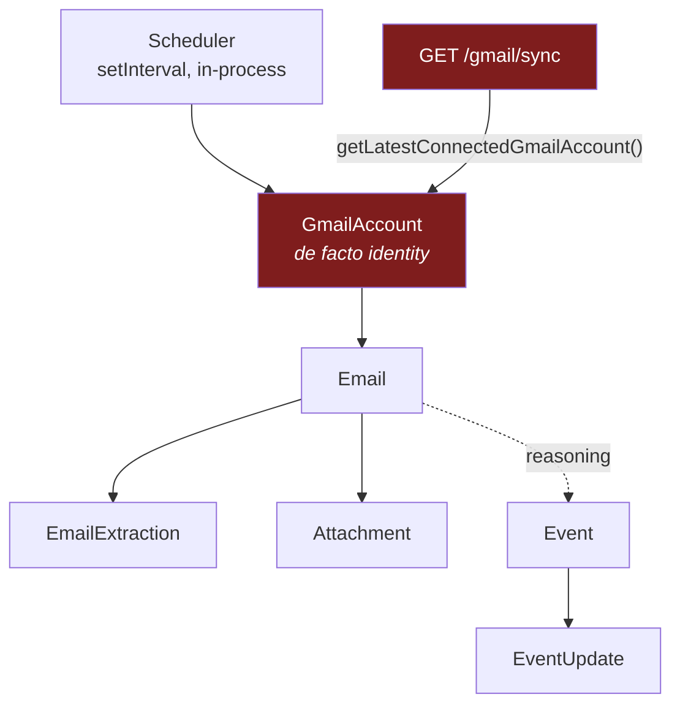
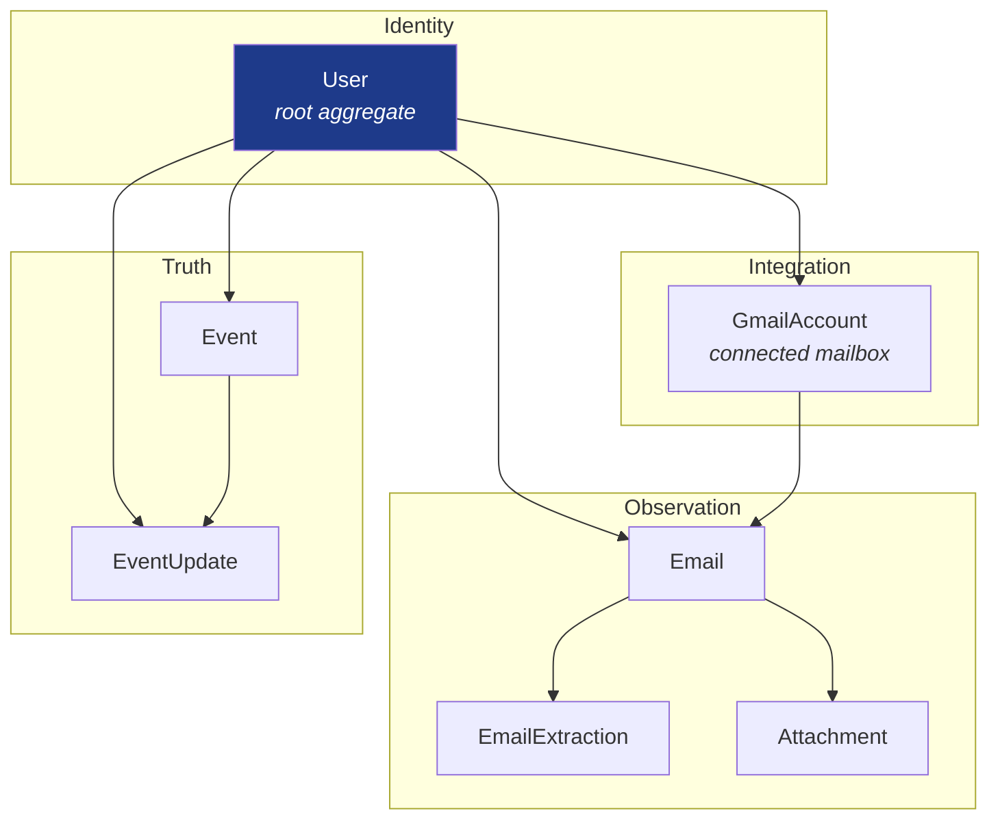
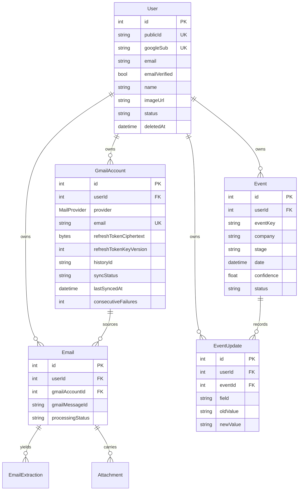
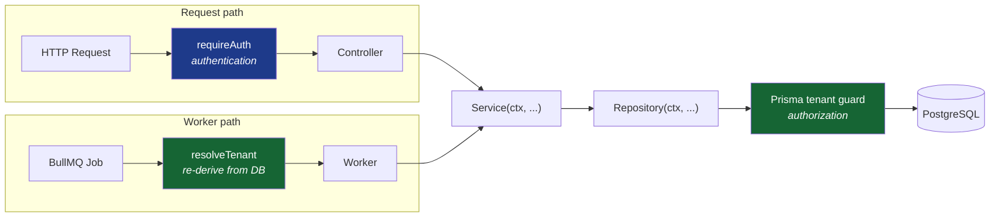
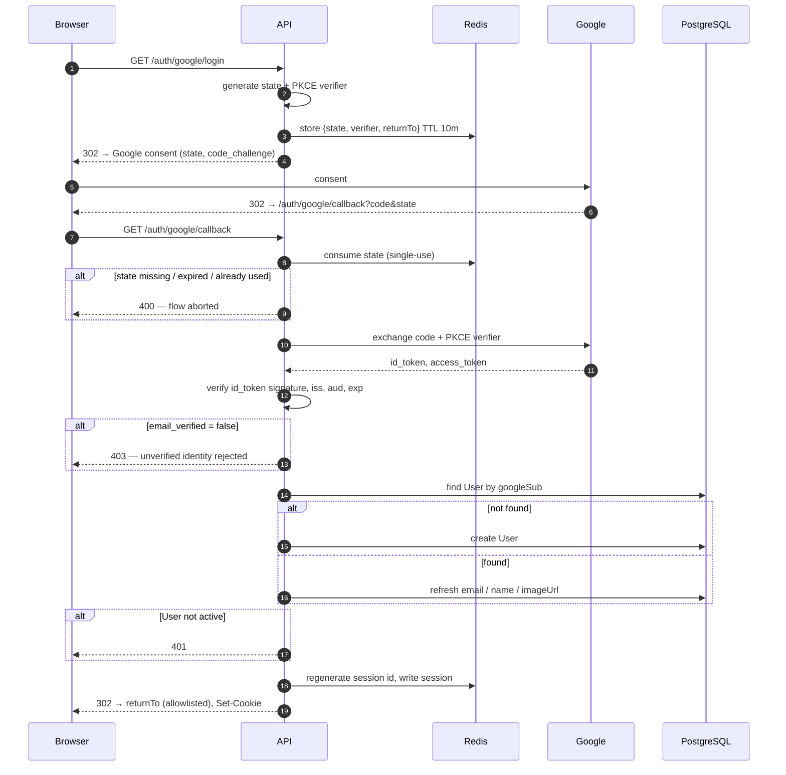
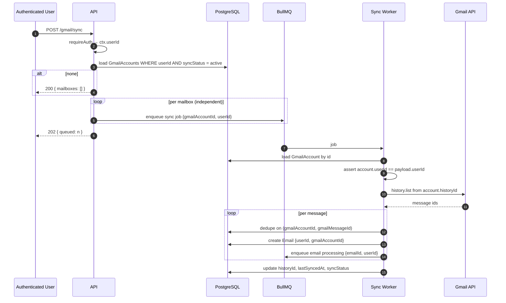
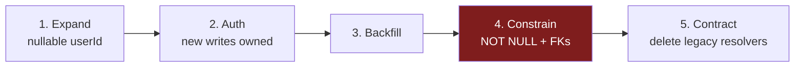

# RFC-001 — Authentication & Multi-User Foundation

Placement Tracker Engineering Handbook — Request for Comments

| | |
|---|---|
| **Status** | Accepted — ready for implementation |
| **Authors** | Ankit Kumar Anand |
| **Date** | 2026-08-02 |
| **Scope** | Identity, authentication, authorization, ownership, mailbox integration, synchronization ownership |
| **Conformance issue** | AC-5 |
| **Depends on** | ADR-006 (Identity Precedes Similarity) |
| **Produces** | ADR-007 (Tenant Bounds the Recognition Universe) — see §7.4 |
| **Supersedes** | Nothing |

> **Numbering.** RFC and ADR sequences are **independent**. RFCs are numbered
> from `001` in `docs/rfcs/`; ADRs continue their own sequence in `docs/06_ADR/`,
> which begins at `006` for historical reasons. RFC-001 producing ADR-007 is
> therefore expected and correct, not a mismatch to be reconciled. An RFC records
> a change; an ADR records a decision. The two are different artifacts with
> different lifecycles, and aligning their numbers would imply a one-to-one
> relationship that does not hold — an RFC may produce zero ADRs or several, and
> an ADR may be produced without an RFC.

---

# 1. Motivation

The system currently assumes a single logical user. That assumption is not
recorded anywhere as a decision; it is an emergent property of every record
belonging, in practice, to one person. It is load-bearing in three places:

- `getLatestConnectedGmailAccount()` (`gmail.repository.ts:39`) resolves *which
  mailbox to sync* by recency rather than by ownership.
- `GmailAccount.email @unique` is the de facto user identity — the mailbox
  address is the only thing in the schema that identifies a human.
- Every recognition query in `matching.service.ts` selects candidates from the
  entire `Event` table, because the entire table belongs to one person.

The moment a second person authenticates, all three become defects, and two of
them become *silent* defects. This RFC introduces the identity foundation that
removes the assumption.

Authentication here is not an API-layer concern bolted onto a finished system.
It establishes the boundary within which the existing reasoning engine operates.
The engine's decision model is untouched by this RFC; the universe of records it
reasons over is not.

---

# 2. Goals

1. Introduce `User` as the root aggregate of the domain.
2. Authenticate users via Google OAuth, with Redis-backed server sessions.
3. Make ownership explicit on every business object in the database.
4. Separate authentication from authorization as distinct, independently
   testable concerns.
5. Support a User connecting **multiple** Gmail mailboxes, each with independent
   synchronization state.
6. Replace recency-based mailbox resolution with ownership-based resolution.
7. Establish a tenant boundary that the recognition engine inherits without
   changing how it decides.
8. Deliver the above as an incremental, reversible migration.

---

# 3. Non-Goals

Explicitly out of scope. Named so that reviewers do not read their absence as an
oversight, and so that implementation does not drift into them.

| Non-goal | Rationale |
|---|---|
| Role-Based Access Control | Every user has exactly one role: owner of their own data. Introducing a role model before a second role exists is speculative structure. |
| Admin dashboard / support impersonation | Requires an audit substrate that does not exist. See §17.3. |
| Team workspaces, organizations, shared events | Would change what an Event *is*, which is a domain-model change, not an auth change. |
| Additional authentication providers | Google OAuth is the only mechanism. No provider-abstraction layer is introduced (§6.3). |
| Email/password authentication | Would require credential storage, reset flows, and verification — none of which the product needs while Gmail access is mandatory anyway. |
| Gmail push notifications (`users.watch` + Pub/Sub) | Sync remains poll-based. This RFC changes *who* is synced, not the transport. |
| Redesign of the sync scheduling mechanism | Scheduling *policy* is architectural and is specified in §14.2. The *mechanism* that implements it — timer, cron, or queue — is not a dependency of authentication and is deferred to implementation (§19.1). |
| Changes to the recognition decision model | ADR-006 is untouched. See §7.4 for the precise statement of what does and does not change. |
| Per-user AI cost accounting / quota | Deferred; noted in §18. |

---

# 4. Background

Three existing architectural commitments constrain this design.

**Emails are immutable observations.** An `Email` record is a fact about
something that arrived. It is never edited. Ownership of an Email is therefore
fixed at ingestion and never reassigned — which makes the tenant key on `Email`
a genuinely immutable column, and makes tenant misattribution unrecoverable
rather than correctable. That asymmetry is why §12 enforces ownership at the
database level rather than in application code.

**Events represent evolving truth.** An `Event` is a conclusion the system
maintains, revised as observations arrive. `EventUpdate` is the immutable
history of those revisions.

**ADR-006 — Identity Precedes Similarity.** Recognition is two phases with
strictly separated authority: *admission* (categorical — does this candidate
satisfy the identity constraints?) followed by *ranking* (continuous — of the
admissible candidates, which is closest?). Similarity never establishes
identity. Critically for this RFC, ADR-006 states that an identity claim resting
on fewer than all three identity attributes "requires **uniqueness within a
bounded range**." Tier 3 of the current engine implements that literally:

```ts
// matching.service.ts:122
if (looseMatches.length === 1) { ... }
```

That predicate is a count over a set. This RFC changes what set it is counted
over. That is the single most consequential interaction between authentication
and the existing architecture, and §7.4 addresses it directly.

---

# 5. Current Architecture



Properties of the current system relevant to this RFC:

| Location | Current behaviour | Multi-user consequence |
|---|---|---|
| `schema.prisma:24` | `Event.eventKey @unique` — globally unique | Two users' identical events collide; `createEvent` returns the *other user's* row |
| `schema.prisma:53` | `Email.gmailMessageId @unique` — globally unique | Asserts a guarantee Gmail does not make (message IDs are mailbox-scoped) |
| `schema.prisma:58` | `Email.gmailAccountId` nullable | Pre-existing rows have no resolvable owner |
| `schema.prisma:137` | `GmailAccount.refreshToken String` | Google refresh tokens stored in plaintext |
| `gmail.repository.ts:7` | `createGmailAccount` upserts on `email` | Re-connecting a mailbox reassigns it and its Email history |
| `gmail.controller.ts:57` | `gmailSyncController` uses latest account | Syncs an arbitrary user's mailbox on any caller's request |
| `gmail.scheduler.ts:6` | Module-level `isRunning` flag | Per-process; two API replicas produce concurrent duplicate syncs |
| `gmail.scheduler.ts:28` | Sequential loop over all accounts | Cycle time is O(mailboxes); one slow mailbox starves the rest |
| `matching.service.ts:24,38,115` | All candidate queries unscoped | Recognition draws candidates from every user's data |
| `email.processor.ts:6` | Job payload is `emailId` only | The write path to `Event` has no identity context whatsoever |

The last row is the structurally important one: **essentially every write to
`Event` and `EventUpdate` happens inside a BullMQ worker, not inside a request.**
An authorization model expressed only as `req.user` would not reach the code that
mutates the domain. §9 addresses this explicitly.

---

# 6. Proposed Architecture

## 6.1 Layer model



Read as: *identity owns integrations; integrations produce observations;
observations revise truth; every layer is bounded by the identity above it.*

## 6.2 Principles

These are normative. Implementation that contradicts them is a defect, not a
variation.

**P1 — User is the root aggregate.** Every business object resolves to exactly
one User. Ownership is never derived from a session, a cookie, a token, or a
mailbox.

**P2 — GmailAccount is an integration, never an identity.** A mailbox is a
*source of observations owned by a User*. It does not identify anyone. A User may
own zero, one, or many mailboxes, and the system must behave correctly at each
cardinality — including zero, which is the state of every user between login and
first mailbox connection.

**P3 — Ownership is explicit and enforced.** Every tenant-scoped table carries a
`userId` column. That column is not documentation: it is enforced by database
constraints such that a record whose tenant disagrees with its parent's tenant is
*unrepresentable*, not merely discouraged (§12.3).

**P4 — Authentication and authorization are separate.** Authentication resolves
*who is calling* and produces a `User`. Authorization decides *whether this User
may act on this record* and is expressed as a tenant predicate on every query.
Middleware performs the first and never the second.

**P5 — Tenant is a property of the request, not of the handler.** Authorization
is enforced at the persistence boundary, in one place, mechanically (§9.3).
A convention that every service "remembers to pass `userId`" is a code-review
policy, not a security boundary.

## 6.3 On provider abstraction

Google OAuth is the only authentication mechanism. Provider fields
(`googleSub`, `email`, `emailVerified`, profile) live **directly on `User`**. No
`AuthIdentity` table, no provider-strategy interface, no polymorphic credential
model is introduced.

*Trade-off, stated for the record:* adding a second provider later requires a
migration that extracts these columns into a separate table and backfills one row
per user. That migration is mechanical, bounded, and reversible. It is a lower
total cost than carrying an unused abstraction through every query, fixture, and
test in the interim — and an abstraction built before its second case is a guess
about what the second case will need. This is a deliberate deferral, not an
oversight.

---

# 7. Domain Model

## 7.1 Entity relationships



## 7.2 Ownership rules

| Entity | Tenant column | Enforcement | Rationale |
|---|---|---|---|
| `User` | — | root | Defines the tenant |
| `GmailAccount` | `userId` | FK → `User` | A mailbox is owned; it is not an identity (P2) |
| `Email` | `userId` | composite FK → `GmailAccount(id, userId)` | Immutable at ingestion; owner can never change |
| `EmailExtraction` | `userId` | composite FK → `Email(id, userId)` | Directly queryable; omitting it would create implicit ownership, which P3 forbids |
| `Attachment` | `userId` | composite FK → `Email(id, userId)` | As above |
| `Event` | `userId` | FK → `User` | Query root for the dashboard; scoping target for recognition |
| `EventUpdate` | `userId` | composite FK → `Event(id, userId)` | Ownership explicit per P3; composite FK prevents divergence from its Event |

**On denormalization.** `Email.userId` is derivable from
`Email → GmailAccount → User`, and `EventUpdate.userId` from
`EventUpdate → Event → User`. Carrying the column anyway is deliberate: it makes
every tenant predicate a single-table condition, keeps indexes on the access path
(§12.4), and satisfies P3's requirement that ownership be readable without a
join. The cost of denormalization is drift, and drift is eliminated by making the
column part of a composite foreign key (§12.3) rather than by trusting write
paths. **A denormalized tenant key is an enforced invariant, never a
convenience.**

## 7.3 Cardinality: mailboxes per User

A User owns 0..N `GmailAccount`s. A mailbox is owned by exactly one User for its
lifetime.

`GmailAccount.email` remains **globally unique**. The consequence is that two
Users cannot connect the same mailbox, and an attempt to do so is an explicit
`409 MAILBOX_ALREADY_LINKED`, never a silent re-link. This replaces the current
`upsert` on `email` (`gmail.repository.ts:7`), which would otherwise reassign a
mailbox — and every `Email` sourced from it — to whichever User connected most
recently. Ownership conflicts are resolved by refusal, never by mutation.

## 7.4 Tenant and the recognition engine

**This RFC does not change the recognition decision model. It bounds the set the
model reasons over.**

ADR-006 defines recognition as admission-then-ranking over a *candidate set*. It
does not define how that set is constructed, because until now the answer was
trivially "everything." With multiple Users, candidate construction requires a
statement, and this RFC makes it:

> **Recognition candidate sets are constructed within a single User by
> construction.** A record belonging to another User is not a rejected candidate;
> it is not a candidate. Tenant is a boundary of the observable universe, not a
> judgement about an observation.

This is deliberately *not* the pattern ADR-006 rejected under "Round equality in
the candidate query." That rejection concerned relocating an **identity
predicate** into SQL, on the grounds that a candidate excluded in SQL cannot be
refused, recorded, or counted — and for a defect defined by invisibility, an
invisible fix is unverifiable. Tenant scoping is categorically different: there
is no refusal to record, because another User's Event was never a proposition
about this User's world. No recognition decision is made and none is suppressed.

**Why this must be stated rather than assumed.** Two concrete failures follow
from adding `userId` columns without scoping candidate construction:

1. **Tier 1 false-merges across tenants.** `createEvent`
   (`event.repository.ts:19-27`) resolves `eventKey` via `findUnique` and returns
   the existing row. With a globally unique `eventKey`, two students receiving
   the same placement broadcast produce one Event — owned by whoever's email was
   processed first. The second student's dashboard renders the first student's
   record, and their emails write `EventUpdate`s onto it. This is precisely the
   silent, unrecoverable false merge ADR-006 exists to make structurally
   impossible, reappearing one level up.
2. **Tier 3 degrades silently.** `looseMatches.length === 1` counted across all
   Users returns `1` progressively less often as the user base grows. The weakest
   recognition tier stops firing — with no error, no log, and no failing test.
   ADR-006's Operational section claims false-merge risk "stops scaling with data
   density." An unscoped tenant model reinstates exactly that property along a new
   axis.

Required changes, all of them to *candidate construction* and none to the
decision model:

| Repository function | Change |
|---|---|
| `findByEventKey` | Accept `userId`; lookup becomes `@@unique([userId, eventKey])` |
| `findNearbyEvents` | Accept `userId`; add tenant predicate |
| `findByCompanyAndStage` | Accept `userId`; add tenant predicate |
| `createEvent` | Accept `userId`; existence check scoped to tenant |
| `findSimilarEvent` | Accept `userId`, or delete if unreachable (verify during AC-5) |

`matching.utils.ts` — `classifyRoundIdentity`, `passesIdentityGate`,
`scoreEventMatch` — is **not modified**. The identity gate, the veto semantics,
the ranking function, and the acceptance floor are untouched. Tier boundaries and
thresholds are untouched.

**This decision is recorded separately as ADR-007 — "Tenant Bounds the
Recognition Universe."** Per handbook convention (`docs/README.md`), a new
architectural decision produces an ADR; this RFC records the change, the ADR
records the decision. ADR-007 is a deliverable of AC-5, not a follow-up.

---

# 8. Identity Model

## 8.1 The authentication key

A User is identified by the Google subject identifier (`sub`) — an opaque,
immutable, per-account string — stored as `User.googleSub` with a unique
constraint. **Account resolution matches on `googleSub` and nothing else.**

`User.email` is stored, indexed, and refreshed from Google on each login, and
carries **no unique constraint**. It is a display and contact attribute.

*Rationale.* Email is not an identity:

- Google Workspace addresses can be renamed. Email-keyed lookup would create a
  second User for the same human and orphan their entire Event history.
- A Workspace administrator can delete and re-create an address. Email-keyed
  lookup would hand the new holder the previous holder's placement history.
- `email_verified` may be false. Treating an unverified address as an identity
  key is a standard account-takeover primitive.

Logins presenting `email_verified: false` are **rejected** at the callback. The
system has no use for an unverified identity, and accepting one creates an
account that a later verified login cannot safely be merged into.

## 8.2 Public identifiers

`User.publicId` (UUID) is the only user identifier that appears in API responses,
logs, or URLs. Internal integer primary keys remain the join keys and never leave
the backend. Sequential integers leak record counts and growth rate and make
enumeration trivial; correct authorization is the actual defense, but there is no
reason to also publish the map.

Other entities retain integer primary keys for this phase. They are addressable
only within an authenticated, tenant-scoped context, and §9.4 requires that
authorization failures be indistinguishable from non-existence.

## 8.3 User lifecycle

```
(none) ──login──> active ──disable──> disabled
                    │
                    └──delete──> soft-deleted ──purge──> (none)
```

- `active` — normal.
- `disabled` — sessions revoked, sync jobs suspended, data retained. Operational
  state; no self-service transition.
- `deleted` — `deletedAt` set, all sessions revoked, all mailbox grants revoked
  at Google, refresh-token ciphertext destroyed. Data purge follows on the
  retention schedule (§18).

Authentication rejects any User not in `active`.

---

# 9. Authorization Model

## 9.1 Two boundaries, not one

Authentication produces `req.user`. Authorization is a *tenant predicate applied
at the persistence boundary*. These are separate mechanisms because they protect
different things and fail at different times — and because, as §5 established,
most writes in this system do not occur inside a request at all.



## 9.2 Tenant context

```ts
type TenantContext = { userId: number };
```

An explicit, required first parameter of every service and repository function
that touches a tenant-scoped model. Not ambient, not optional, not carried in
async-local storage — an unset ambient context is indistinguishable from a
correctly-set one at the call site, and that is exactly the property that makes
tenant bugs invisible.

## 9.3 Enforcement at the persistence boundary

A Prisma Client extension (`$extends`, `query` hook) intercepts every operation
on a tenant-scoped model and **throws** if the query lacks a `userId` predicate
(directly, or via a scoped composite relation). Models are enumerated explicitly;
an unlisted model is a build-time failure, so adding a tenant-scoped table
without registering it cannot silently ship.

*Trade-off against PostgreSQL Row-Level Security.* RLS is the stronger control:
it survives raw SQL, migrations, and any future non-Prisma consumer. It is
rejected for this phase because it requires per-request session variables
(`SET LOCAL`) bound to connection checkout, which interacts poorly with Prisma's
pooling and with BullMQ workers holding long-lived connections, and because the
resulting failure mode — an empty result set — is harder to detect in tests than
a thrown exception. The client extension is proportionate now; RLS is the stated
upgrade path if a second database consumer appears (§18).

## 9.4 Response semantics

A request for a record owned by another User returns **`404 Not Found`**, never
`403 Forbidden`. `403` confirms existence, which is a cross-tenant information
leak in a system where record IDs are enumerable.

| Condition | Status |
|---|---|
| No session | `401` |
| Session valid, User not `active` | `401`, session destroyed |
| Record does not exist | `404` |
| Record exists, owned by another User | `404` |
| Valid, owned, malformed input | `400` |

## 9.5 Worker authorization

Queue payloads are **not** an authenticated channel. Any process with Redis
access can enqueue arbitrary payloads, so a `userId` in a job is a hint, not a
claim.

Payloads carry `{ emailId, userId }`. The worker loads the `Email`, re-derives
`userId` from the persisted row, and **asserts it matches the payload**. A
mismatch is a hard failure — the job is failed, not retried, and the event is
logged at error level, because it means either a payload was forged or an
ownership invariant has been violated upstream. Only the re-derived value is used
to construct the `TenantContext`.

---

# 10. Authentication Flow

Two distinct OAuth flows exist. Conflating them is the most common source of
refresh-token bugs, so they are specified separately.

| | Login flow | Mailbox connection flow |
|---|---|---|
| Purpose | Establish identity | Grant mailbox read access |
| Scopes | `openid`, `email`, `profile` | `gmail.readonly` |
| `access_type` | (default) | `offline` |
| `prompt` | (unset) | `consent` |
| Produces | Session | `GmailAccount` + refresh token |
| Requires session | No | **Yes** |

## 10.1 Login



Normative requirements:

- `state` is server-generated (≥128 bits CSPRNG), stored server-side, bound to
  the pre-authentication session, **single-use**, and expires in 10 minutes.
- **PKCE** (`S256`) is used. It is not optional for public-facing OAuth clients,
  and it costs nothing here.
- The `id_token` is verified cryptographically — signature against Google's JWKS,
  plus `iss`, `aud`, `exp`. A `userinfo` round-trip is not a substitute.
- The session identifier is **regenerated** after successful authentication.
  Reusing the pre-authentication session identifier is session fixation.
- `returnTo` is resolved against a server-side allowlist of relative paths. An
  attacker-controlled redirect target is an open redirect and an OAuth code-leak
  vector.

## 10.2 Mailbox connection

```mermaid
sequenceDiagram
    autonumber
    participant B as Browser
    participant A as API
    participant R as Redis
    participant G as Google
    participant DB as PostgreSQL
    participant Q as BullMQ

    B->>A: GET /gmail/accounts/connect (authenticated)
    A->>R: store {state, verifier, userId} TTL 10m
    A-->>B: 302 → Google (gmail.readonly, offline, prompt=consent)

    B->>G: consent
    G-->>B: 302 → /gmail/accounts/callback?code&state

    B->>A: GET /gmail/accounts/callback
    A->>R: consume state; assert state.userId == session.userId
    A->>G: exchange code
    G-->>A: refresh_token?, access_token, granted scopes
    A->>A: assert gmail.readonly granted
    A->>G: resolve mailbox address
    A->>DB: lookup GmailAccount by email

    alt owned by another User
        A-->>B: 409 MAILBOX_ALREADY_LINKED
    else owned by this User (reconnect)
        A->>DB: update; keep stored token if none returned
    else new
        A->>DB: create GmailAccount (encrypted token)
    end

    A->>Q: enrol mailbox for background sync (§14.2)
    A-->>B: 302 → /settings/mailboxes
```

Normative requirements:

- **`state.userId` must equal the session User.** Without this check the callback
  attaches a mailbox to whichever session presents the code — a cross-account
  mailbox-injection vector.
- **Refresh-token absence is not an error when a token is already stored.**
  Google issues a refresh token only on first consent. The rule is: *if the
  exchange returns no refresh token and one exists for this mailbox, retain the
  stored one; error only if neither exists.* The current unconditional throw
  (`gmail.controller.ts:32`) would fail every reconnection.
- Granted scopes are validated against requested scopes. Google permits partial
  grants; a mailbox connected without `gmail.readonly` is stored `disabled` with
  a reconnect prompt rather than syncing and failing repeatedly.

## 10.3 Logout

`POST /auth/logout` destroys the server-side session, removes it from the User's
session index, and clears the cookie with matching attributes. It does **not**
revoke Google grants — mailbox connections survive logout by design. Grant
revocation is bound to mailbox disconnection and account deletion.

---

# 11. Session Management

## 11.1 Storage

Sessions are stored in Redis. There is no session table in PostgreSQL.

| | |
|---|---|
| Key | `sess:{sessionId}` |
| Value | `{ userId, googleSub, createdAt, lastSeenAt, absoluteExpiresAt, ip, userAgent }` |
| Session ID | ≥128 bits CSPRNG, signed with a rotating secret |
| Idle TTL | 7 days, rolling |
| Absolute lifetime | 30 days, non-extendable |
| Index | `user_sessions:{userId}` (Redis Set) for enumeration and bulk revocation |

The absolute lifetime is enforced independently of the rolling TTL. Without it, a
rolling session is effectively permanent, and "revoke everything" has no natural
expiry to fall back on. Session records store `userId`, not a `User` snapshot:
authorization decisions must reflect current state, so a disabled or deleted User
is rejected on the next request rather than on the next login.

## 11.2 Cookie policy

| Attribute | Value | Rationale |
|---|---|---|
| `HttpOnly` | always | Removes the cookie from XSS reach |
| `Secure` | production | Non-negotiable; development over `localhost` exempt |
| `SameSite` | `Lax` | Adequate CSRF mitigation for top-level navigation while permitting the OAuth redirect return |
| `Path` | `/` | |
| `Domain` | registrable domain | See §11.3 |
| Name | `__Host-`-prefixed where the `Domain` attribute is not required | Binds the cookie to origin and path |

## 11.3 Deployment topology (constraint, not preference)

**The API and the frontend must be served from the same registrable domain** —
e.g. `app.example.com` and `api.example.com`, cookie scoped to `.example.com`.

This is a hard constraint on the session architecture, not a deployment
convenience. Split across unrelated registrable domains (a frontend on one
platform, an API on another), the session cookie is a third-party cookie:
`SameSite=None; Secure` becomes mandatory, Safari ITP and Chrome's third-party
cookie restrictions block or cap it, and users are logged out non-deterministically
with no server-side error to diagnose. A same-site topology, or a same-origin BFF
proxy fronting the API, is required.

## 11.4 CSRF

`SameSite=Lax` is the primary control. It is not the only one:

1. **Origin/Referer validation** on every state-changing request, against an
   allowlist. Rejected requests return `403`.
2. **Double-submit token** for all `POST`/`PATCH`/`DELETE` routes: a token issued
   in a readable cookie and echoed in a request header, compared server-side.
3. **No state-changing `GET`.** `GET /gmail/sync` (`gmail.route.ts:13`) triggers
   synchronization today and must become `POST`. `SameSite=Lax` permits
   cross-site top-level `GET`s, so a state-changing `GET` is CSRF-reachable by
   construction.

## 11.5 Redis operational constraints

Sessions and BullMQ share Redis infrastructure but **must not share eviction
semantics**.

- BullMQ requires `maxmemory-policy noeviction`. An evicted job key is a silently
  lost job.
- Session stores are commonly deployed with `allkeys-lru`. Applied to the queue
  instance, that policy destroys jobs under memory pressure.

Required: a **separate Redis logical database** for sessions at minimum; a
separate instance preferred in production. The queue instance runs `noeviction`.
Session expiry is by TTL only — never by eviction. Session clients must **not**
inherit the queue client's `maxRetriesPerRequest: null` (`redis.ts:3`), which is
a BullMQ requirement and the wrong failure behaviour for a request-path
dependency: a request should fail fast, not hang.

---

# 12. Database Changes

## 12.1 New model

```prisma
model User {
  id       Int    @id @default(autoincrement())
  publicId String @unique @default(uuid())

  googleSub     String  @unique
  email         String
  emailVerified Boolean @default(false)
  name          String?
  imageUrl      String?

  status    String    @default("active") // active | disabled | deleted
  createdAt DateTime  @default(now())
  updatedAt DateTime  @updatedAt
  lastLoginAt DateTime?
  deletedAt DateTime?

  gmailAccounts GmailAccount[]
  emails        Email[]
  events        Event[]
  eventUpdates  EventUpdate[]

  @@index([email])
}
```

## 12.2 Modified models

```prisma
enum MailProvider {
  GOOGLE
}

model GmailAccount {
  id       Int          @id @default(autoincrement())
  userId   Int
  provider MailProvider @default(GOOGLE)

  email     String  @unique // a mailbox is claimed by exactly one User
  googleSub String?         // subject of the Google account owning the mailbox

  refreshTokenCiphertext Bytes
  refreshTokenKeyVersion Int
  grantedScopes          String[]

  historyId           String?
  syncStatus          String    @default("pending") // pending|active|auth_failed|disabled
  lastSyncedAt        DateTime?
  lastSyncError       String?
  consecutiveFailures Int       @default(0)

  connectedAt DateTime @default(now())
  createdAt   DateTime @default(now())
  updatedAt   DateTime @updatedAt

  user   User    @relation(fields: [userId], references: [id], onDelete: Cascade)
  emails Email[]

  @@unique([id, userId])              // composite-FK anchor
  @@index([userId])
  @@index([syncStatus, lastSyncedAt])
}

model Email {
  id             Int    @id @default(autoincrement())
  userId         Int
  gmailAccountId Int                        // was nullable
  gmailMessageId String                     // was globally @unique

  subject String
  body    String
  sender  String

  receivedAt       DateTime @default(now())
  processingStatus String   @default("pending")
  failureReason    String?
  createdAt        DateTime @default(now())

  user         User         @relation(fields: [userId], references: [id])
  gmailAccount GmailAccount @relation(fields: [gmailAccountId, userId], references: [id, userId])

  extractions EmailExtraction[]
  attachments Attachment[]

  @@unique([gmailAccountId, gmailMessageId])
  @@unique([id, userId])
  @@index([userId, receivedAt])
  @@index([userId, processingStatus])
}

model Event {
  id       Int    @id @default(autoincrement())
  userId   Int
  eventKey String                           // was globally @unique

  // ... unchanged domain fields ...

  user    User          @relation(fields: [userId], references: [id])
  updates EventUpdate[]

  @@unique([userId, eventKey])
  @@unique([id, userId])
  @@index([userId, date])
  @@index([userId, status])
}

model EventUpdate {
  id      Int @id @default(autoincrement())
  userId  Int
  eventId Int

  field    String
  oldValue String
  newValue String

  updatedAt DateTime @default(now())

  user  User  @relation(fields: [userId], references: [id])
  event Event @relation(fields: [eventId, userId], references: [id, userId], onDelete: Cascade)

  @@index([userId, eventId])
}
```

`EmailExtraction` and `Attachment` receive `userId` and a composite relation to
`Email(id, userId)` on the same pattern.

**On `MailProvider`.** The provider is currently encoded only in the *name*
`GmailAccount`. The enum makes it **data** rather than nomenclature. Three
reasons, none of them speculative:

1. **A discriminator is cheap now and expensive later.** Adding a single-variant
   enum column to an empty-ish table during the Phase-1 expand migration costs one
   column. Retrofitting a discriminator onto a populated table that other tables
   reference by composite foreign key requires a backfill and a nullable window
   during which the provider of a row is genuinely unknown.
2. **It lets integration code assert rather than assume.** The sync path selects
   the Gmail transport because the row *is* Gmail. Today that is an unstated
   invariant held by a type name; with the column it is a checkable precondition,
   and a row that ever fails it fails loudly instead of being handed to the wrong
   client.
3. **It removes a rename from any future change.** A second mailbox provider
   would otherwise require renaming a table carrying FK dependencies from `Email`,
   `EmailExtraction`, and `Attachment` — a migration whose cost is unrelated to the
   feature motivating it.

**What this field is not.** It is not a provider abstraction. There is no
strategy interface, no polymorphic token handling, no per-provider table, and no
dispatch keyed on it. Sync code remains Gmail-specific and may assert
`provider == GOOGLE`. This is consistent with §6.3: the discriminator records a
fact that is already true, whereas an abstraction would encode a guess about a
second case that does not exist. `@default(GOOGLE)` exists so the expand
migration needs no backfill; it should be dropped if a second variant is ever
added, so that new rows must state their provider explicitly.

Note that mailbox provider is orthogonal to authentication provider. Google OAuth
remains the sole authentication mechanism and no equivalent field is introduced
on `User` — §6.3 and §3 are unchanged by this.

## 12.3 Integrity by construction

The `@@unique([id, userId])` declarations exist solely to serve as composite
foreign-key targets. Their effect:

```
Email.gmailAccount     → GmailAccount(id, userId)
EventUpdate.event      → Event(id, userId)
EmailExtraction.email  → Email(id, userId)
Attachment.email       → Email(id, userId)
```

A child row whose `userId` differs from its parent's violates a foreign key and
is rejected by PostgreSQL. Tenant divergence becomes **unrepresentable** rather
than merely incorrect. This is what converts the denormalization of §7.2 from a
risk into a guarantee, and it is why denormalized tenant keys are acceptable here
at all.

## 12.4 Constraint changes and their rationale

| Change | Reason |
|---|---|
| `Event.eventKey` unique → `@@unique([userId, eventKey])` | An event key individuates an activity *within a user's world*. Global uniqueness silently merges two users' identical events (§7.4). |
| `Email.gmailMessageId` unique → `@@unique([gmailAccountId, gmailMessageId])` | Gmail message IDs are mailbox-scoped. The global constraint asserts a guarantee Google does not make; the failure mode is a second mailbox's message classified as a duplicate and never ingested — invisible, because `syncSingleMessage` returns success. |
| `Email.gmailAccountId` nullable → required | Required for the composite FK. Rows without a resolvable source cannot have an enforceable owner. |
| `GmailAccount.refreshToken` → `refreshTokenCiphertext` + `refreshTokenKeyVersion` | §16.2 |
| New composite indexes | Every query gains a tenant predicate; existing single-column indexes no longer match the access path. |

**Note on `findNearbyEvents`.** It filters `company` case-insensitively
(`event.repository.ts:83`) while `findByCompanyAndStage` matches exactly
(`event.repository.ts:105`). The insensitive variant will not use a plain btree
index. Tenant scoping changes the selectivity profile of both queries; AC-5 must
either normalize company at write time or add an expression index. This is
recorded here because the indexes are being changed anyway, not because this RFC
resolves the inconsistency.

---

# 13. Gmail Integration

## 13.1 Mailbox state

Each `GmailAccount` maintains **independent** synchronization state: its own
`historyId` cursor, its own `syncStatus`, its own failure counters. No state is
shared between a User's mailboxes. A mailbox whose grant is revoked must not
affect its sibling mailboxes' synchronization.

```
pending ──first sync──> active
active  ──401/403 from Google──> auth_failed   (user must reconnect)
active  ──N consecutive failures──> disabled   (backoff exhausted)
any     ──user disconnects──> (deleted, grant revoked at Google)
```

`auth_failed` and `disabled` mailboxes are excluded from scheduling. Without
this, a single revoked grant retries indefinitely on every cycle, burning API
quota and masking real failures in the logs.

## 13.2 Refresh-token handling

- Encrypted at rest with AES-256-GCM under a key supplied via environment or KMS.
  `refreshTokenKeyVersion` accompanies each ciphertext so keys can be rotated
  without a synchronous re-encryption of every row.
- Decrypted only within the sync path, in memory, immediately before use.
- **Never** returned by any API, never logged, never included in error payloads
  or telemetry.
- Destroyed on mailbox disconnection and on account deletion, after the grant is
  revoked at Google's revocation endpoint.

---

# 14. Synchronization Flow

## 14.1 Ownership-first resolution



The controller resolves mailboxes **by ownership**. `getLatestConnectedGmailAccount()`
and `getFirstGmailAccount()` are deleted, not deprecated — a recency-based
resolver left in the codebase will be called again.

## 14.2 Scheduling policy

Scheduling **policy** is architectural, because it is a statement about ownership
and mailbox lifecycle. The scheduling **mechanism** is not.

### Architectural requirements (normative)

**S1 — Selection by ownership and state.** Background synchronization selects
mailboxes by owner and `syncStatus`, never by recency. There is no scheduled
counterpart to `getLatestConnectedGmailAccount()`.

**S2 — One mailbox per unit of work.** Each scheduled unit covers exactly one
mailbox. Cursor, failure state, and backoff are per-mailbox (§13.1). No unit
spans two mailboxes or two Users.

**S3 — Tenant context is not waived for background work.** Every scheduled unit
carries `{ gmailAccountId, userId }` and re-derives `userId` from the persisted
row before use, exactly as the request-triggered path does (§9.5). Work is not
exempt from authorization because it lacks a request.

**S4 — Lifecycle exclusion.** Mailboxes in `auth_failed` or `disabled` are
excluded from scheduling (§13.1).

**S5 — No concurrent sync of the same mailbox.** Two runs against one mailbox
race on the `historyId` cursor. The mechanism must prevent this; *how* is the
mechanism's own concern.

### Determination: the mechanism is an implementation concern

S1–S5 are satisfiable by the **existing** in-process scheduler, with its account
query narrowed to owned, active mailboxes and its job payload carrying tenant
context. Multi-tenancy does not make a timer incorrect: each `GmailAccount` row
already carries its owner, sync is already per-mailbox, and tenant context is
derived from the row rather than from whatever triggered the work. Once S1–S5
hold, no cross-tenant read or write is reachable through the scheduler.

What multi-user does is make the current mechanism's **pre-existing** limitations
bite harder — per-process `isRunning` (`gmail.scheduler.ts:6`), sequential
O(mailboxes) cycle time (`:28`), absent per-mailbox backoff, and execution inside
the web process. Those are scalability and operability defects. They predate this
RFC, they are not caused by authentication, and correcting them is not a
precondition for correct multi-user behaviour.

Replacing the timer with BullMQ repeatable jobs is therefore recorded as an
**implementation task (§19.1)**, not as an architectural requirement of this RFC.
It is expected to complete during Phase 3 implementation and is verified at
Stage 6 (§20), but **a deployment satisfying S1–S5 on the existing mechanism is
conformant with this RFC.**

**Per-mailbox rate limiting** is required regardless of mechanism — Gmail
enforces per-user quota, and any scheme syncing N mailboxes concurrently will
reach it.

## 14.3 Processing pipeline

`enqueueEmailProcessing(emailId)` becomes `enqueueEmailProcessing({ emailId, userId })`.
`processEmailJob` re-derives `userId` from the `Email` row, asserts agreement
(§9.5), constructs the `TenantContext`, and threads it through
`processEmail → matchEventV2 → createEventService / updateEventService` and every
repository call beneath them.

---

# 15. API Impact

## 15.1 New endpoints

| Method | Path | Auth | Purpose |
|---|---|---|---|
| `GET` | `/auth/google/login` | — | Begin login |
| `GET` | `/auth/google/callback` | — | Complete login, create session |
| `POST` | `/auth/logout` | session | Destroy session |
| `POST` | `/auth/logout/all` | session | Revoke all sessions for the User |
| `GET` | `/auth/session` | session | Current User (`publicId`, name, email, image) |
| `GET` | `/gmail/accounts` | session | List owned mailboxes and sync state |
| `GET` | `/gmail/accounts/connect` | session | Begin mailbox connection |
| `GET` | `/gmail/accounts/callback` | session | Complete mailbox connection |
| `DELETE` | `/gmail/accounts/:id` | session | Disconnect mailbox, revoke grant |
| `POST` | `/gmail/accounts/:id/sync` | session | Sync one mailbox |

## 15.2 Changed endpoints

| Endpoint | Change |
|---|---|
| `GET /gmail/sync` | → `POST /gmail/sync`. Requires auth. Syncs **all** owned mailboxes; no longer resolves "latest account". Method change per §11.4. |
| `GET /gmail/auth`, `GET /gmail/callback` | Replaced by the two flows of §10. The current single flow conflates login with mailbox connection. |
| `GET /event` | Requires auth; tenant-scoped |
| `GET /event/:id` | Requires auth; `404` for other tenants' events |
| `POST /event` | Requires auth; `userId` from context, **never** from the request body |
| `PATCH /event/:id` | Requires auth; tenant-scoped; CSRF token required |
| `POST /email` (`email.routes.ts:6`) | Unauthenticated ingestion endpoint. Must be removed, or gated behind auth and restricted to non-production. As written it accepts arbitrary emails into the pipeline with no owner. |
| `GET /health` | Unauthenticated, unchanged. Must not leak counts or version detail. |

## 15.3 Frontend contract

- All requests use `credentials: "include"`. CORS is already configured for this
  (`app.ts:10-15`); the origin allowlist must become explicit and
  environment-driven.
- `401` triggers a redirect to login; the client must not retry.
- The client never sends `userId` in any form. A `userId` in a request body is
  ignored — never trusted — and its presence is worth logging.
- The mailbox list is a first-class UI surface: zero mailboxes, `auth_failed`,
  and `disabled` are all reachable states requiring user action.

---

# 16. Security Considerations

## 16.1 Threat model

| Threat | Control |
|---|---|
| Cross-tenant read | Tenant predicate enforced at the persistence boundary (§9.3) |
| Cross-tenant write via worker | Ownership re-derived from the database, payload treated as untrusted (§9.5) |
| Session theft via XSS | `HttpOnly`; no token in JS-reachable storage |
| Session theft in transit | `Secure`; HSTS |
| CSRF | `SameSite=Lax`, origin validation, double-submit token, no state-changing `GET` (§11.4) |
| Session fixation | Session ID regenerated post-authentication (§10.1) |
| OAuth CSRF / code injection | Single-use session-bound `state`, PKCE (§10.1) |
| Open redirect | Server-side `returnTo` allowlist (§10.1) |
| Mailbox hijack | Global mailbox uniqueness, `409` on conflict, never re-link (§7.3) |
| Mailbox injection into another account | `state.userId` asserted against session (§10.2) |
| Identity drift / takeover via email change | Identity keyed on `googleSub`; unverified emails rejected (§8.1) |
| Refresh-token disclosure | Encrypted at rest, never leaves the backend (§13.2) |
| Record enumeration | `404` for cross-tenant access; `publicId` for users (§8.2, §9.4) |
| Brute force / abuse | Rate limiting (§16.3) |

## 16.2 Secrets

`SESSION_SECRET` (rotatable, supporting a verification list during rotation),
`TOKEN_ENCRYPTION_KEY` + `TOKEN_ENCRYPTION_KEY_VERSION`, `GOOGLE_CLIENT_ID`,
`GOOGLE_CLIENT_SECRET`. All required at boot; **the process must fail to start if
any is absent in production.** A missing secret that degrades to a default is a
silent security failure. `Development_Environment.md` must be updated with each.

## 16.3 Rate limiting

Currently absent everywhere. Required on: `/auth/google/login` and both callbacks
(per IP), mailbox connection (per User), and manual sync triggers (per User —
otherwise a user can exhaust their own Gmail quota and generate unbounded worker
load).

## 16.4 Compliance dependency

Gmail read scopes are **restricted scopes** under the Google API Services User
Data Policy. This constraint does not bind while the application accesses only
the developer's own mailbox in testing mode; it binds the moment external users
authenticate — which is precisely what this RFC enables.

Implications, recorded as a dependency with lead time measured in weeks:

- OAuth app verification is required, including a published privacy policy and a
  scope-justification demonstration.
- Restricted scopes additionally require a periodic third-party security
  assessment (CASA).
- Unverified applications are subject to a test-user cap and degraded consent
  screens.
- Policy mandates a user data deletion path and encryption of stored user data —
  §8.3 and §13.2 satisfy these, and are written to satisfy them.

**Verification must be initiated before public rollout begins, not after.** It is
the most likely blocker of Phase 5 (§20) and is not on the engineering critical
path, which is exactly why it gets missed.

---

# 17. Testing Strategy

## 17.1 The core requirement

The failure mode this RFC introduces is **silent cross-tenant leakage**. It
produces no exception and no log line. The existing suites
(`matching.service.test.ts`, `event.service.test.ts`, `gmail.service.test.ts`)
are structurally blind to it because every fixture is implicitly single-tenant.

> **All reasoning-engine tests use a two-tenant fixture by default.** A
> single-tenant fixture is how tenant defects stay invisible.

## 17.2 Required suites

**Tenant isolation (new, blocking).**

| Case | Expected |
|---|---|
| Two Users, identical `(company, stage, date)` | Two distinct Events, no shared `EventUpdate` |
| User B's Events present during User A's Tier-1 lookup | User A's key resolves only within User A |
| User B's Events present during User A's Tier-2 candidate query | User B's Events never scored |
| User B has N Events matching User A's Tier-3 query | User A's `looseMatches.length === 1` uniqueness test unaffected |
| Repository call without `TenantContext` | **Throws** (the §9.3 guard, verified as a test, not a convention) |
| Worker job with mismatched `userId` | Job fails; no write occurs |
| `Email` insert with `userId` ≠ `gmailAccount.userId` | Rejected by the database (§12.3) |

The first four are the ADR-006 D-1 regression suite lifted to the tenant axis.
They are written *against the same scenarios* the D-1 tests use, so a reader can
see that tenant leakage and round leakage are the same class of failure at
different scopes.

**Negative authorization.** Every tenant-scoped endpoint, exercised with User A's
session against User B's resource, asserting `404` — not `403`, not `200` with an
empty body.

**Authentication.** Rejected: replayed `state`, expired `state`, `state` from a
different session, missing PKCE verifier, tampered `id_token`, `email_verified:
false`, login for a non-`active` User. Verified: session ID changes across the
callback boundary; `returnTo` outside the allowlist is discarded.

**Mailbox connection.** Reconnection with no refresh token returned retains the
stored token. Connecting a mailbox owned by another User returns `409` and
mutates nothing. Partial scope grant produces a `disabled` mailbox.

**Session lifecycle.** Idle expiry, absolute expiry despite activity, logout
invalidation, `logout/all` revoking every session, and a session for a
subsequently-disabled User rejected on its next request.

**Migration.** Each migration phase (§19) is tested forward and backward against
a seeded database, with the backfill verified for zero nulls before the
`NOT NULL` phase.

## 17.3 Explicitly not covered

No audit-log assertions (no audit log exists — §3). No test asserts the absence
of an admin bypass, because no admin path is built; if one is added later, that
test becomes mandatory.

---

# 18. Alternatives Considered

Recorded for the durable "why is it built this way?" question. These are settled;
they are not open for re-litigation without new information.

**JWT-based stateless authentication.** Rejected. The system is already stateful
in exactly the way JWTs are meant to avoid — refresh tokens must be persisted
server-side regardless — so statelessness buys nothing while costing revocation.
Revocation is a hard requirement here (account deletion, §8.3; disabled users;
compromised sessions), and implementing it over JWTs means a server-side
denylist, which is a session store with extra steps and worse ergonomics.
Session state is O(active users), not O(requests), which for this product is a
small bounded number.

**Hybrid OAuth → session → internal JWT.** Rejected. Introduces token issuance,
rotation, and expiry-skew handling to serve a service-to-service boundary that
does not exist. Revisit only if a separate consumer appears that cannot carry
cookies.

**Provider abstraction (`AuthIdentity` table).** Rejected for this RFC. Reasoning
and the accepted future migration cost are in §6.3.

**Shared canonical Events across users.** Rejected. A single canonical Event per
real-world placement drive, with per-user visibility rows, would enable
cross-user corroboration ("37 students received this, so it is real") — a
genuinely attractive future capability. It is rejected now because per-user
state that already exists (`confidence`, `status`, and especially the
human-`confirmed` authority guard at `event.service.ts:44`) is not shareable, so
the canonical model requires splitting `Event` into canonical and per-user halves
— a domain-model change, which §3 excludes. Recorded as a known future pressure
in ADR-007; it is the alternative most likely to be revisited.

**PostgreSQL Row-Level Security.** Deferred, not rejected. Reasoning and the
trigger for adoption are in §9.3.

**Sync scheduling mechanism.** Not an architectural alternative. The scheduling
*policy* this RFC requires (S1–S5) is mechanism-independent; see §14.2 for the
determination and §19.1 for the implementation task that carries the trade-off.

---

# 19. Migration Strategy

Strict expand/contract. Every phase deploys independently and is individually
reversible. No phase leaves the application unable to serve traffic.



| # | Phase | Contents | Rollback |
|---|---|---|---|
| 1 | **Expand** | Add `User`. Add **nullable** `userId` to all tenant-scoped tables. Add the `MailProvider` enum and `GmailAccount.provider` (defaulted, so no backfill is needed — §12.2). Add new indexes `CONCURRENTLY`. No behaviour change. | Drop columns and enum; nothing reads them |
| 2 | **Authenticate** | OAuth flows, sessions, `requireAuth`. New writes populate `userId`. Legacy paths still functional. Composite constraints not yet enforced. | Disable auth routes; revert middleware |
| 3 | **Backfill** | Assign existing records to the User owning their originating mailbox. Assign `Event`/`EventUpdate` via their originating Emails. Verify zero nulls. | Read-only phase; no schema change |
| 4 | **Constrain** | `NOT NULL` on every `userId`. Add `@@unique([id, userId])` anchors and composite FKs. Replace `Event.eventKey` unique with `@@unique([userId, eventKey])`, `Email.gmailMessageId` with `@@unique([gmailAccountId, gmailMessageId])`. Enable the §9.3 guard. | Drop constraints; columns remain populated |
| 5 | **Contract** | Delete `getLatestConnectedGmailAccount()`, `getFirstGmailAccount()`. Remove or gate `POST /email`. Retire the `setInterval` scheduler **if** §19.1 has landed; otherwise narrow it to S1–S5 and leave it in place. | Code revert |

**Phase 3 — production data.** Current production data belongs to a single
person. The backfill assigns all of it to the User created by that person's first
authenticated login. `Email` rows predating account tracking have
`gmailAccountId = NULL` (`schema.prisma:58`) and therefore no derivable owner;
they are assigned to the same single User by the same rule. This shortcut is
valid **only** because production is single-tenant at migration time. Phase 3
must run before any second user authenticates — enforced operationally by
completing the migration before public rollout (§20), not by a code guard.

**Phase 4 — operational notes.** `Event.eventKey` requires
`CREATE UNIQUE INDEX CONCURRENTLY` followed by constraint attachment; adding it
inline takes a write-blocking `ACCESS EXCLUSIVE` lock. `NOT NULL` addition on
PostgreSQL 12+ with a validated check constraint avoids a full-table rewrite.
Phase 4 is the only irreversible-in-practice phase and must not be deployed until
Phase 3's null count is verified at zero.

## 19.1 Implementation task — sync scheduling mechanism

**Not an architectural dependency** (§14.2). Recorded here so it is owned and
scheduled rather than lost, and so its trade-off survives outside the RFC body.

**Task.** Replace the in-process `setInterval` scheduler (`gmail.scheduler.ts`)
with BullMQ repeatable jobs, one per mailbox, keyed
`jobId = gmail-sync:{gmailAccountId}`.

| Property | Existing timer | Repeatable jobs |
|---|---|---|
| Same-mailbox concurrency (S5) | `isRunning` is per-process; N replicas sync concurrently | Deterministic `jobId` dedupes across replicas |
| Cycle time | O(mailboxes), sequential | Parallel, bounded by worker concurrency |
| Failure isolation | One slow mailbox delays every mailbox behind it | Per-job |
| Backoff | None; a revoked grant retries every cycle | Per-mailbox exponential backoff |
| Process placement | Web process, competing with request handling | Worker process |

**Sequencing.** Land during Phase 3 implementation; verified at Stage 6 (§20).

**Conformance.** S1–S5 (§14.2) must hold both before and after this task. The
only requirement the existing timer does not satisfy on its own is **S5 under
multiple replicas** — a single-replica deployment satisfies it via `isRunning`.
If this task slips, the conformant interim state is the existing scheduler
narrowed to owned, active mailboxes and carrying tenant context, run at a single
replica. That constraint is the reason the task is scheduled rather than
optional, and the reason it is not a blocker: it bounds deployment topology, not
correctness.

---

# 20. Rollout Plan

| Stage | Gate | Rollback |
|---|---|---|
| **1. Schema expand** | Migrations 1 applied; suite green | Down migration |
| **2. Auth in staging** | Login, mailbox connect, reconnect, logout verified end-to-end; session lifecycle suite green | Feature flag off |
| **3. Tenant enforcement in staging** | Tenant isolation suite (§17.2) green with the §9.3 guard enabled; two seeded users verified isolated | Disable guard, revert services |
| **4. Backfill + constrain in production** | Zero-null verification; constraints applied; smoke test on real data | Phase 4 constraints dropped |
| **5. Public rollout** | **Google OAuth verification complete (§16.4)**; rate limiting live; monitoring live | Restrict to allowlisted accounts |
| **6. Contract** | Legacy resolvers deleted; §19.1 landed, or the single-replica interim constraint explicitly accepted and documented; one full sync cycle observed clean | Code revert |

Stage 5 is gated on an external dependency with multi-week lead time. Start
§16.4 during Stage 1.

**Monitoring required before Stage 5:** authentication success/failure rates by
reason; session creation and expiry rates; per-mailbox sync success, duration,
and `auth_failed` transitions; tenant-guard violations (must be **zero** — any
occurrence is a defect, not noise); worker `userId` assertion failures (also
zero); Gmail quota consumption per user.

---

# 21. Consequences

## 21.1 Positive

Ownership becomes a database-enforced property rather than an application
convention. Cross-tenant divergence is unrepresentable (§12.3) rather than
merely tested-against. Synchronization becomes deterministic: a mailbox is synced
because a User owns it, not because it was connected most recently, which makes
the sync path testable for the first time. The recognition engine gains a bounded
universe, which restores ADR-006's property that false-merge risk does not scale
with data density — along the tenant axis as well as the round axis. Multiple
mailboxes per user, with independent state, arrives as a property of the model
rather than as a later feature.

## 21.2 Negative

Every service and repository signature in the tenant-scoped path changes. This is
a wide, mechanical diff touching most of `src/modules`, and it must land as one
coherent change per module rather than incrementally, because a half-scoped
module is worse than an unscoped one — it *looks* enforced.

Test fixtures become more expensive: two-tenant setup for every reasoning test
(§17.1) is a real ongoing cost, accepted because the alternative is a test suite
that cannot observe the defect class this RFC introduces.

Per-user Events mean identical placement drives are stored once per student. This
is duplication by design, consistent with the handbook's stated preference for
duplicates over false merges (ADR-006), and it forecloses cross-user
corroboration until the alternative in §18 is revisited.

Google OAuth verification introduces an external dependency on the launch
critical path that the engineering team does not control.

## 21.3 Operational

Redis becomes a request-path dependency, not only a queue dependency: a Redis
outage now means nobody can authenticate, where previously it meant jobs stopped.
This raises Redis's availability requirement and makes the eviction-policy
separation of §11.5 an operational invariant rather than a tuning preference.

Sync becomes per-mailbox in its state, its failures, and its lifecycle (§13.1),
making mailbox health individually observable — and individually failing, which
is the point. That property follows from the ownership model, not from the
scheduling mechanism (§14.2), so it holds whether or not §19.1 has landed.

The tenant guard converts a class of silent bug into a loud exception. Expect it
to fire during implementation on paths nobody remembered existed. That is the
mechanism working.

---

# 22. Open Questions

Non-blocking. Each has a safe default; resolve during or after AC-5.

1. **`EventUpdate` provenance.** `EventUpdate` records what changed but not which
   `Email` caused it. Tenant-scoped auditing ("which of *my* emails changed
   this?") is unanswerable without it, and cross-tenant misattribution would be
   undiagnosable after the fact. Adding `sourceEmailId` is deliberately **not**
   included here — it is a provenance change, not an auth change, and belongs in
   its own record. Default: defer, and raise as a separate `G-n` gap.
2. **Session store library.** `express-session` + `connect-redis` versus a
   purpose-built store. The former is mature and sufficient; the latter avoids
   `express-session`'s implicit session creation. Default: `express-session`,
   with `saveUninitialized: false`.
3. **Mailbox limit per User.** Unbounded mailbox connection is a quota-exhaustion
   vector. Default: soft cap of 5, configurable.
4. **Data retention after soft-delete.** §8.3 defines the state; the purge
   interval is unset. Default: 30 days, subject to §16.4 policy review.
5. **Per-user AI cost.** Multi-user makes OpenAI spend unbounded and
   unattributed. No quota model is proposed here. Default: monitor first, then
   decide.

---

# 23. Confidence

Per handbook convention.

**Verified against source.** Every claim about current behaviour was read from
the repository at commit `fa4851f`: schema constraints (`backend/prisma/schema.prisma`),
recency-based mailbox resolution (`gmail.repository.ts:39`, `gmail.controller.ts:57`),
mailbox upsert-on-email (`gmail.repository.ts:7`), unconditional refresh-token
throw (`gmail.controller.ts:32`), unscoped candidate queries
(`matching.service.ts:24,38,115`), the Tier-3 uniqueness predicate
(`matching.service.ts:122`), the scoped-out worker path
(`email.processor.ts:6` → `email.service.ts:70` → `event.service.ts`), the
in-process scheduler and its per-process guard (`gmail.scheduler.ts:6,28`), the
shared Redis client configuration (`redis.ts:3`), the unauthenticated ingestion
route (`email.routes.ts:6`), and the existing route surface (`app.ts:46-48`).

**Inferred, not verified.** That production data is currently single-tenant
(§19, Phase 3) is assumed from the single-user architecture, not confirmed
against a production database — the backfill rule depends on it and must be
re-confirmed before Phase 3 runs. Phase-4 lock behaviour reflects standard
PostgreSQL semantics and has not been rehearsed against a production-sized
dataset. Google's restricted-scope verification requirements (§16.4) are stated
from policy as understood at the date of this RFC and must be re-checked against
current Google documentation before Stage 5; timelines are estimates.

**Not covered by tests.** Nothing in this RFC is currently tested — no
authentication, session, tenant-isolation, or negative-authorization test exists
in the repository. §17 defines the suites that must exist before AC-5 is
considered complete. Until they do, every claim in §21.1 is intent rather than
evidence.
